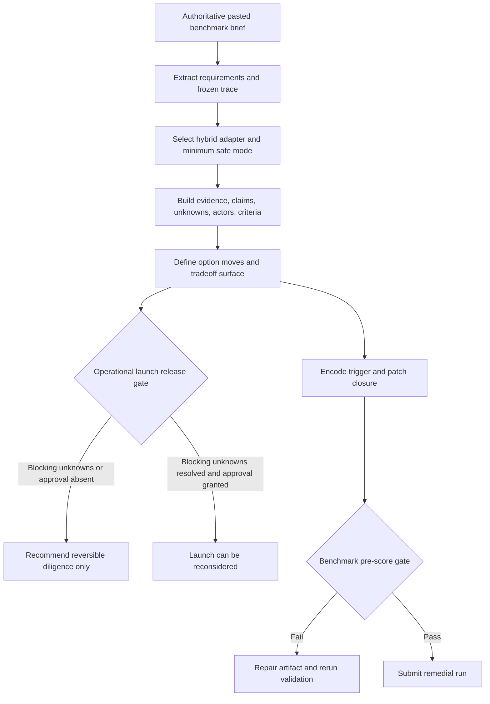
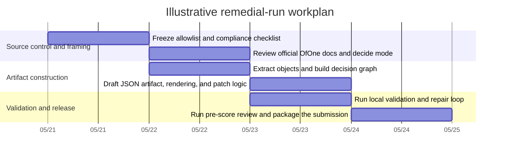

# Strategic Gated Diligence Remedial Run Research Report

## Executive Summary

This remedial run is best understood as a tightly bounded benchmark-repair exercise, not as a fresh benchmark sweep and not as permission to inspect any neighboring artifacts. The authoritative brief limits work to one specific rerun identifier, forbids inspecting outputs from other arms or the original excluded full-OfOne answer, and requires a very specific raw-output structure: an exact benchmark header followed by `## Artifact JSON`, `## Validator Result`, `## Rendering`, and `## Patch Report`. The same brief also requires an exact `benchmark_trace` carrying the frozen file paths and hashes for the case file, arm prompt, and input bundle. fileciteturn0file0 citeturn6view0

The case itself points toward a conservative decision posture: recommend a **reversible diligence move** and keep **operational launch gated** until explicit approval and blocker resolution are in place. That reading is supported by the case framing, which asks for a decision-ready answer that separates what is known, assumed, and blocked, and by both OfOne’s gate/unknown machinery and established gated-decision literature. Stage-Gate separates scoping and business-case work from launch through formal go/kill gates, while real-options reasoning shows why preserving the option to wait can be valuable when commitment is at least partly irreversible and uncertainty is still being resolved. fileciteturn0file0 citeturn17view1turn6view0turn16view0turn11view0

For the actual OfOne artifact, **Map** is the most plausible minimum safe mode. Micro is too thin for this case because the prompt pressures actor ownership, blocking unknowns, option moves, gates, and patch logic. Audit is safer only if the operator intends to include the full review layer, such as review-log entries and explicit gate approvals. OfOne’s own docs say to choose the smallest mode that preserves safety; Map mode specifically requires artifact identity, criteria, tradeoff surface, temporal model, edges, loops, option moves, and the core graph, while Audit adds the fuller lifecycle layer and review logging. fileciteturn0file0 citeturn17view0turn6view0

The practical critical path is not prose drafting. It is **source control, object design, and local validation**. OfOne’s own compile loop is artifact-first, and the validator model makes clear that `validator_result` inside the artifact is not self-proving. A notable implementation risk is public-document drift: the repo’s materials are not perfectly aligned on version labeling, and `package.json` still wires `npm run validate` to `examples/*.json`, which means the remedial artifact will need an explicit local validation path rather than a casual assumption that validation “just ran.” citeturn17view0turn6view0turn4view3turn17view1turn3view2turn7view0

## Benchmark Requirements Extracted From the Authoritative Text

The table below is distilled from the attached benchmark brief and sharpened where the official OfOne validation model changes interpretation. fileciteturn0file0 citeturn6view0

| Aspect | Extracted requirement | Analytical implication |
|---|---|---|
| Objective | Produce a **full OfOne response** for the case objective as a **remedial rerun** that repairs one excluded slot, without inspecting or rewriting the original excluded answer. | The run should optimize for **case fidelity and compliance repair**, not novelty or broader benchmark exploration. |
| Scope | Launch **only** run `2026-05-17-batch-01__case-strategic-gated-diligence-001__full_ofone__frontier_reasoning__r1__rerun1`. Treat the pasted text as complete and authoritative. Do not inspect other arms, Batch 01 outputs, or reviews. | A strict **source allowlist** is required. Even public benchmark pages or repo folders that expose neighboring artifacts should be treated as forbidden. |
| Deliverables | Exact benchmark header, one fenced JSON artifact, a separate validator-status section, a human-readable rendering, and a patch report. | The deliverable is a **four-part submission package**, not just a JSON file. |
| Timeline | The brief gives **sequence** but not a concrete deadline: the rerun occurs after original exclusion and before benchmark scoring/comparison. | A workplan must be inferred. The real deadline driver is the **pre-score compliance gate** rather than a stated calendar date. |
| Stakeholders | At minimum: the team considering launch, decision owner/operator, reviewer/approver, benchmark validator/reviewer, and affected parties implied by the normative-evaluative axis. | The artifact must name **roles and authorities**, even if personal names are unavailable. |
| Success criteria | Correct benchmark trace; separation of evidence, claims, graph structure, criteria, option moves, gates, and rendering; explicit source identity and unknowns; legal relations; no superiority claims; independence from other arms; diagnostics if validation cannot pass. | There are **two success layers**: artifact validity and benchmark validity. Passing one does not guarantee the other. |
| Data needs | Frozen hashes and trace fields; role ownership; blocking unknowns; gate conditions; update trigger; source provenance; validator capability. | The missing pieces are not just factual—they are **typed state objects** the validator expects. |
| Risks | Semantic graph errors, mode mismatch, false validation attestation, missing actor/gate ownership, cross-arm contamination, unresolved blocking unknowns, and source/version drift. | The highest-probability failures are **compliance and semantics**, not writing quality. |

The most important analytical distinction is that **artifact validity is not the same thing as benchmark validity**. The validator model explicitly says a full-OfOne artifact can be schema-valid and still be benchmark-invalid if it has the wrong case ID, omits required arm outputs, leaks other-arm information, or makes unsupported superiority claims. It also states that pre-score compliance checks case fidelity, required outputs, independence, and no-superiority compliance before aggregate scoring. citeturn6view0

A second practical distinction is between the **case gate** and the **benchmark gate**. The case gate controls whether the team can move from diligence to launch. The benchmark gate controls whether the remedial artifact is eligible to be submitted and scored. Those should be modeled separately. fileciteturn0file0 citeturn6view0

There is also a concrete contamination risk in the public surfaces themselves. The repo root openly exposes a `benchmarks/` folder, and the GitHub Pages site publicly indexes multiple strategic benchmark artifacts and reviews, including prior remedial artifacts and reviews. Because the brief forbids inspecting those materials, the actual remedial run should freeze a narrower allowlist that includes only the attached brief and the official specification docs, not benchmark artifact pages. fileciteturn0file0 citeturn3view2turn3view1turn17view0

## Gated Diligence Logic And Decision Gates

The case asks for a decision-ready answer that separates diligence from launch, identifies the release-controlling gate, and states what update would change the recommendation. OfOne’s traversal order and decision-lifecycle layer provide the internal structure for doing that, while Stage-Gate and real-options logic explain why a reversible diligence step should often precede launch when uncertainty and irreversibility are still material. fileciteturn0file0 citeturn17view1turn6view0turn16view0turn11view0

| Gate | Purpose | What must be true to pass | Default status from available context | Owner role |
|---|---|---|---|---|
| Run-scope gate | Confirm this work is only the named remedial rerun and has not used forbidden benchmark outputs. | Source allowlist frozen; no other-arm or prior-output contamination. | **Must be explicitly checked**. | Benchmark operator / reviewer |
| Mode-and-adapter gate | Confirm the artifact uses a suitable mode and a hybrid adapter view. | Map selected as minimum safe mode, or Audit selected deliberately; strategic-agentic and normative-evaluative axes explicitly assigned. | **Open but decidable now**. | Artifact author with reviewer oversight |
| Evidence sufficiency gate | Confirm enough evidence exists to state knowns, assumptions, blockers, and source identity. | Attached brief captured as evidence; unknowns created instead of prose gaps; provenance recorded. | **Partially open**. | Artifact author |
| Operational launch release gate | Distinguish diligence authorization from launch authorization. | Blocking unknowns either resolved or accepted by policy; named human approval gate exists; launch criteria pass. | **Blocked / pending** on current information. | Decision owner + required approver |
| Patch trigger gate | Define the update that would change the rendered recommendation. | At least one concrete trigger links new evidence to affected objects and closure. | **Should be authored**, not inferred later. | Artifact author + reviewer |
| Benchmark pre-score gate | Ensure aggregate eligibility. | Exact header and sections; matching benchmark trace; independence; no superiority claim; validator/patch outputs handled correctly. | **Final release gate**. | Benchmark reviewer / validator |

The **primary case gate** is the operational launch release gate. On the available evidence, that gate should default to **blocked or pending**, because the brief gives no fact showing that a named approver has signed off, that rendering-blocking unknowns have been resolved, or that launch-specific criteria have been satisfied. In contrast, the reversible diligence move can be recommended earlier because it is the lower-commitment option and is aligned with both Stage-Gate scoping/business-case logic and real-options logic about preserving flexibility under uncertainty. fileciteturn0file0 citeturn16view0turn16view1turn11view0

## Prioritized Research Plan And Workplan

For the actual remedial run, the source hierarchy should be: the attached brief first; then the official OfOne docs explicitly surfaced by that brief; then the local schemas/validator/render/patch scripts; and only then external decision frameworks for methodological interpretation rather than case facts. OfOne’s own compiler guidance is artifact-first, requires explicit classification of evidence versus claims versus unknowns, and says blocked decisions should be represented as `unknown` and `information_value` objects rather than glossed over in prose. fileciteturn0file0 citeturn17view0turn6view0turn6view1turn4view3turn7view0

| Priority | Task | Method | Primary sources to consult | Output | Estimated effort |
|---|---|---|---|---|---|
| Highest | Freeze source boundary and forbidden surfaces | Build an allowlist and a “do not open” list before drafting | Attached brief; SKILL source-boundary rules; validation model benchmark workflow | Source control memo and compliance checklist | 0.75 h |
| Highest | Decide mode and adapter mix | Close reading of output-mode and profile requirements | SKILL output modes and adapter projection; validation model mode-aware profiles; adapter contracts | Mode decision memo, likely **Map** with strategic + normative axes | 1.25 h |
| Highest | Stand up local validation path | Confirm repo access, schema location, and how the validator will be called on the actual artifact | README, package.json, schemas, validator doc | Working validation command for the remedial artifact | 1.50 h |
| High | Extract benchmark obligations into typed objects | Convert brief into evidence, claims, assumptions, unknowns, criteria, gates, triggers | Attached brief; object schemas | Requirement object inventory | 1.50 h |
| High | Build case graph and decision surface | Draft actors, criteria, option moves, tradeoff surface, temporal model, and blockers | SKILL traversal; object schemas; validation model | First-pass artifact skeleton | 2.25 h |
| High | Draft patch logic and recommendation boundary | Define update trigger and affected closure; separate diligence recommendation from launch authorization | Attached brief; validation model; Pages/README patch descriptions | Trigger set and draft patch report | 1.25 h |
| High | Draft human-readable rendering | Render only after object graph is coherent | SKILL artifact-first rule; README/script docs | Decision-native rendering section | 1.00 h |
| Highest | Run validation and repair loop | Iterate on schema and semantic diagnostics; archive machine outputs if available | Validator model; package scripts; local schemas/scripts | Validated or diagnostically transparent artifact | 2.50 h |
| High | Run benchmark pre-score review | Check trace, header, four required sections, independence, no-superiority | Attached brief; validation model | Final submission package | 0.75 h |

**Estimated total focused effort:** about **12.75 hours**, assuming the repo and local Node environment are already available. If local validator setup is not already working, add roughly **1–2 hours** for environment troubleshooting. That setup is worth front-loading because the brief says the artifact should omit `validator_result` unless local validation truly ran, and the validation docs say computed validator output—not self-attestation—is what counts. fileciteturn0file0 citeturn6view0turn7view0

The repo’s public instructions deserve one extra caution: the docs broadly say “run `npm run validate`,” but `package.json` currently binds that script to `examples/*.json`. In practice, validating the remedial artifact probably means invoking the validator directly on the artifact path or staging the file where the script expects it. That is a small but important implementation risk. citeturn17view1turn4view3turn7view0

The following templates are adapted from OfOne’s published object schemas and validator expectations. They are meant for the **internal research pack**, not for the human rendering itself. citeturn6view1turn6view0

**Evidence ledger template**

| evidence_id | source type | locator / span | retrieved_at | source_owner | recency | reliability | content_hash | supports | risks |
|---|---|---|---|---|---|---|---|---|---|
| E-001 | file / url / tool | | | | current / dated / unknown | low / medium / high | | claim IDs | stale / selection bias / ambiguity |

**Gate and blocker register template**

| id | object type | description | blocks | owner | evidence needed to clear | resolution move | status |
|---|---|---|---|---|---|---|---|
| G-001 / U-001 | gate / unknown | | option IDs, rendering IDs, release state | role placeholder | | | open / resolved / accepted_risk / blocked |

**Validator and benchmark-compliance checklist template**

| check | required basis | pass / fail | notes |
|---|---|---|---|
| Exact run header present | benchmark brief | | |
| Four required sections present | benchmark brief | | |
| `benchmark_trace` exact-match values | benchmark brief + validation model | | |
| Mode/profile correct | SKILL + mode-aware profiles | | |
| Actors present for hybrid case | validation model | | |
| Blocking unknowns reference valid IDs | validation model | | |
| `expected_effects` references only edge IDs | brief + object schema semantics | | |
| No illegal edges or relation misuse | brief + validation model | | |
| No cross-arm or prior-output contamination | brief + benchmark workflow validation | | |
| No superiority claim | brief + benchmark workflow validation | | |

The brief gives no calendar deadline, so the Gantt below is an **illustrative execution schedule**, assuming work starts immediately and validator access exists. fileciteturn0file0

## Alternative Frameworks And Fit

The comparison below is not a recommendation to replace OfOne. The benchmark requires an OfOne artifact. The value of the external frameworks is interpretive: they help explain why the remedial run should distinguish diligence from launch, why launch should be gated, and how to prioritize the next informational steps. The synthesis here is grounded in official OfOne docs, Cooper’s Stage-Gate material, Pindyck’s real-options logic, and McGrath’s discovery-driven strategy work. fileciteturn0file0 citeturn17view0turn6view0turn16view0turn11view1turn11view0turn14view1

| framework name | description | pros | cons | fit for this case |
|---|---|---|---|---|
| OfOne Map | Typed decision-map method that separates evidence, claims, unknowns, options, gates, triggers, and rendering, then validates the graph before release. | Directly matches benchmark requirements; strong on explicit blockers, gate ownership, patchability, and benchmark traceability. | High modeling overhead; validator-sensitive; easy to fail on semantic details if rushed. | **Essential**. This is the execution framework required by the benchmark. |
| Stage-Gate | Governance approach that breaks work into stages separated by go/kill gates with deliverables, criteria, and outputs before launch. | Excellent for separating diligence from launch; clarifies gatekeepers, deliverables, criteria, and resource decisions. | Can become heavy or bureaucratic if copied too literally; does not itself solve JSON graph legality or evidence typing. | **High**. Best supplemental framework for modeling the release gate and the distinction between diligence and launch. |
| Real options | Decision logic that values preserving the option to wait when commitment is partly irreversible and uncertainty is unresolved. | Strong rationale for approving a reversible diligence move while delaying launch; fits the case’s “reversible diligence before operational launch” framing. | Less useful for specifying actor ownership, benchmark trace, or artifact structure. | **High**. Best supplemental framework for the recommendation logic and kill-threshold thinking. |
| Discovery-driven experimentation | Strategy approach for uncertain, fast-moving contexts that emphasizes experimentation, learning, and evolving assumptions rather than treating the initial plan as fixed. | Helpful for designing low-cost diligence tasks and surfacing assumptions explicitly. | Weaker than OfOne on formal validation and benchmark-specific release rules. | **Medium to high**. Useful for shaping the diligence plan, but secondary to OfOne and Stage-Gate for this benchmark. |

The best practical blend is straightforward: **OfOne for the artifact, Stage-Gate for the governance shape, real-options for the defer-versus-commit logic, and discovery-driven experimentation for the design of the reversible diligence move itself**. That combination stays faithful to the benchmark while still grounding the recommendation in well-established decision logic. citeturn17view0turn16view0turn11view0turn14view1

## Evidence Map And Assumptions

The evidence map below links the main analytical claims in this report to their primary support. Where a row is an inference rather than a direct prompt requirement, that is stated explicitly. fileciteturn0file0 citeturn6view0turn17view0

| Claim | Source(s) | Notes |
|---|---|---|
| The run scope is limited to a **single remedial rerun identifier** and must not inspect other arms or prior outputs. | fileciteturn0file0 | Direct extraction from the brief. |
| The actual response package must begin with the exact benchmark header and then provide **Artifact JSON, Validator Result, Rendering, and Patch Report**. | fileciteturn0file0 | Direct extraction from the brief. |
| `benchmark_trace` must match the frozen run metadata, file paths, and hashes exactly, and benchmark validation is stricter than artifact validation. | fileciteturn0file0 citeturn6view0 | Direct requirement plus validator interpretation. |
| **Map** is the most plausible minimum safe mode for this case; **Audit** is a fallback if full review-log machinery is required. | fileciteturn0file0 citeturn17view0turn6view0 | Inference from output-mode guidance, mode-aware profiles, and case pressure points. |
| Because the case mixes **strategic-agentic** and **normative-evaluative** concerns, actor ownership and legitimacy must be explicit. | fileciteturn0file0 citeturn6view2turn6view0 | Directly supported by adapter and profile requirements. |
| The correct default recommendation is likely **approve reversible diligence, block operational launch pending a gate**. | fileciteturn0file0 citeturn16view0turn16view1turn11view0 | Inference from case framing plus gated-launch and real-options logic. |
| A patch trigger should be explicitly modeled, because the brief asks what update would change the recommendation and OfOne treats patch closure as a first-class object. | fileciteturn0file0 citeturn3view1turn17view0turn6view0 | Direct requirement plus OfOne lifecycle design. |
| The public repo surfaces create a contamination risk because they expose benchmark materials the brief forbids inspecting. | fileciteturn0file0 citeturn3view2turn3view1 | Directly supports the need for a frozen allowlist. |
| The public docs are not perfectly aligned on version labeling, so validator behavior and concrete schema files should outrank summary prose. | citeturn4view3turn17view1turn3view2turn7view0 | Inference from the official materials’ version drift. |
| Local validation needs operational care because the published `npm run validate` script targets `examples/*.json`, not obviously the remedial artifact path. | citeturn7view0turn17view1turn6view0 | Inference from package wiring and validator docs. |

The brief leaves several implementation details unspecified. The assumptions below keep the run conservative and auditable rather than overclaiming. fileciteturn0file0

| Assumption | Why it is needed | Risk if wrong |
|---|---|---|
| Work begins immediately and the Gantt is illustrative rather than contractual. | The brief gives sequence but no deadline. | The schedule may be off by one or more days, but the task order still holds. |
| No personal names are available for the decision owner or approver, so role placeholders will be used. | The case stresses ownership but does not name individuals. | Audit-mode expectations could rise if named approvals are later required. |
| The actual case facts do **not** extend beyond the pasted brief for benchmark purposes. | The user explicitly said the pasted text is authoritative and complete. | Pulling in extra case facts could violate scope or benchmark boundaries. |
| Map mode is the default unless an operator explicitly decides to produce Audit-mode review logs. | Mode is not stated in the brief. | If Audit is actually expected, a Map artifact may be under-scoped. |
| Local validator access is available or can be set up. | The benchmark deliverable is safer if local validation can really run. | Without it, the output must stay limited to expected validator status and diagnostic transparency. |
| The recommendation-changing update trigger will be framed as “blocking unknown(s) resolved plus required approval obtained.” | The brief asks for the update that changes the recommendation but does not specify its exact content. | A weaker trigger may not cleanly justify changing from diligence to launch. |

## Open Questions And Recommended Next Actions

The unresolved issues below are the ones most likely to affect mode choice, blocked-release status, or benchmark eligibility. Each one maps to an explicit requirement in the brief or validator docs. fileciteturn0file0 citeturn6view0turn17view0

| Open question | Why it matters | Recommended next action |
|---|---|---|
| Is the local repo and validator environment available right now? | Determines whether the run can truthfully include computed validator status and machine-generated validator artifacts. | Verify Node/npm access, schemas, and the exact file-path invocation for the artifact before drafting the final JSON. |
| Is **Map** sufficient, or does the operator want **Audit** because gate approvals and review logs must be fully auditable? | Changes required object coverage and effort. | Decide mode before object drafting; do not “upgrade” halfway through without revisiting the schema checklist. |
| Who exactly owns the operational launch gate? | The case requires actor/reviewer ownership and required approval. | Name the role at minimum; if the name is unavailable, keep the gate explicitly blocked/pending. |
| What exact evidence would clear the rendering-blocking unknowns? | Needed for `unknown`, `information_value`, and patch logic. | Create a blocker register with one row per rendering-blocking unknown and the exact evidence needed to clear it. |
| What exact update should flip the recommendation from diligence to launch reconsideration? | The patch report depends on an explicit trigger and bounded closure. | Define one concrete “recommendation-changing trigger” now rather than narrating it vaguely later. |
| Are machine-generated validator and patch artifacts with hashes expected in the submission package, beyond the narrated sections? | The validation docs strongly imply they matter for aggregate-eligible benchmark runs. | Confirm submission expectations and archive those artifacts if the environment allows it. |
| What is the precise source allowlist for the actual run? | Public repo and Pages surfaces expose forbidden benchmark artifacts and reviews. | Freeze an allowlist containing only the brief and official spec surfaces; treat benchmark artifact pages as out of bounds. |

The recommended execution order is therefore simple: **freeze the source boundary, decide Map versus Audit, assign the gate-owner role, build the blocker register, draft the artifact first, and only then render and validate**. That order follows OfOne’s own artifact-first compile loop, respects the benchmark’s independence rules, and keeps the launch recommendation appropriately gated until the typed evidence actually supports a release decision. citeturn17view0turn6view0turn16view0turn11view0