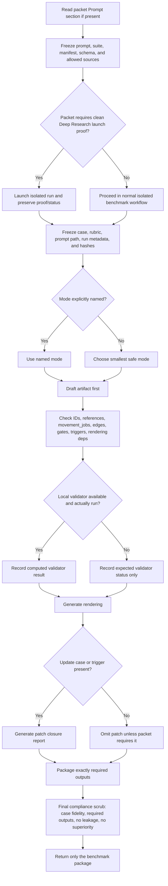

# Running an Unspecified OfOne Benchmark Packet Exactly

## Executive summary

The public OfOne materials do expose a real benchmark scaffold, but they do **not** expose one single standalone “packet spec” that governs every run. Instead, the benchmark contract is distributed across the full-OfOne arm prompt, the benchmark suite, the batch manifest, the OfOne skill protocol, the object-schema guide, the validation model, the public examples, and the output directories that show how run artifacts are stored. Across those official materials, a **full OfOne benchmark run** consistently revolves around four substantive deliverables: an OfOne artifact, a validator result, a human rendering, and a patch report when the case includes an update event or trigger. Public benchmark outputs also show a run-scoped file pattern consisting of a raw Markdown run output plus separate `.artifact.json`, `.validator.json`, `.rendering.md`, and `.patch.json` companions. citeturn16view0turn27view1turn17view3turn15view0turn15view1turn15view2turn15view3

The most important operational fact is that **benchmark validity is stricter than schema validity**. The official validation model says an OfOne artifact can be schema-valid and still be benchmark-invalid if it is bound to the wrong case, omits required outputs, leaks information from another arm, or makes unsupported superiority claims. It also says that full-OfOne benchmark runs use `benchmark_trace` to bind the artifact to the frozen case file, arm prompt, and input bundle, and that rejected runs must remain auditable rather than silently overwritten. citeturn29view0turn29view1

Because your scenario assumes the packet is **unspecified**, the safest analytical rule is simple: treat every packet-specific requirement as absent unless the packet explicitly states it, but once a packet *does* specify something, follow it literally and let it override softer defaults. Under that conservative reading, the correct workflow is to freeze the instruction surfaces, choose the packet-required or smallest safe mode, compile the artifact first, validate it or truthfully describe expected validation status, generate rendering and patch outputs, and then return **only** the package format the packet requested, with no extra essay, memo, or commentary. That reading is the closest fit to the public full-OfOne prompt, the artifact-first skill protocol, and the benchmark workflow rules. citeturn16view0turn25view1turn29view0turn29view2

## What the Prompt section can mean

Because the packet is unspecified here, the phrase **“run the packet exactly as the Prompt section instructs”** has to be interpreted as a hierarchy of instruction surfaces rather than as a single known format. The public OfOne benchmark materials support a conservative hierarchy: the run’s prompt file defines the output contract for the benchmark arm; the suite and manifest define frozen benchmarking requirements and release guardrails; schemas and the validation model define what counts as structurally and semantically valid; the skill protocol defines how OfOne is supposed to compile an artifact; and the case/rubric provide task content and review expectations rather than independent formatting authority. The official skill protocol is also explicit that source material is data, not instruction, so case files, web pages, prior reports, and other inputs should influence the artifact as evidence or claims, not silently inject commands into the run. citeturn16view0turn27view1turn17view0turn25view1turn28view0turn29view2

A conservative reader of an unspecified packet should therefore assume the following interpretations.

| Interpretation | Operational reading | Default if the packet is silent |
|---|---|---|
| Literal output-contract interpretation | Return exactly the deliverables named in the prompt, in the format the prompt names. If the prompt says four required sections or files, produce those and nothing else. | Use the public full-OfOne arm contract: artifact JSON, validator result, rendering, patch report if update case. |
| Benchmark-binding interpretation | Treat run IDs, case IDs, case file paths, prompt file paths, and input hashes as frozen bindings, not ornamental metadata. | If no frozen bindings are given, include only the metadata expressly required by the prompt or package wrapper. |
| Mode-selection interpretation | If the packet names a mode, obey it. If it says “appropriate mode,” choose the smallest safe mode. | Use the smallest safe mode from the skill protocol; for normal full-OfOne benchmark use, Map is the public default pattern. |
| Validation-truthfulness interpretation | Do not claim local validation ran unless it actually ran. If validation cannot be run, state expected status honestly. | Separate “artifact” from “expected validator result,” because public docs treat `validator_result` as computed, not self-attested. |
| Patch-requirement interpretation | If the case contains an update trigger, a patch report is part of the package. If the packet makes it always-required, include it always. | Follow the public full-OfOne rule: patch report for update/trigger cases. |
| Isolation / no-leakage interpretation | Do not inspect other arm outputs, copied examples, or prior excluded outputs unless the packet explicitly allows that. | Treat other-arm outputs as off-limits during execution. |
| Launch-control interpretation | If the packet requires a clean Deep Research conversation, visible launch proof, or status transitions, those are benchmark-control requirements, not optional embellishments. | If the packet says nothing, there is no extra launch-proof requirement beyond the normal benchmark package itself. |

This synthesis is grounded in the official full-OfOne arm prompt, the benchmark suite’s formal list of required outputs, the skill protocol’s artifact-first and source-boundary rules, and the validation model’s distinction between artifact validity and benchmark validity. citeturn16view0turn27view1turn25view1turn28view0turn29view0turn29view1

Several **specific sub-interpretations** matter in practice. First, “Prompt section” can mean **formatting instructions**, such as section headers, first-line text, or single-message versus multi-file packaging. The official public prompt is fairly abstract, but the public output directory shows that official runs have been stored as a raw Markdown wrapper plus sidecar files, which means format is not inherent to OfOne alone; it is partly a run-harness choice. Second, “Prompt section” can mean **schema and semantic constraints**, because the official full-OfOne prompt requires a schema-valid artifact, and the validation model defines semantic checks such as movement jobs, legal edge relations, option/gate consistency, decision-rendering dependencies, information value for rendering-blocking unknowns, and benchmark-trace readiness. Third, “Prompt section” can mean **benchmark-control instructions**, such as clean-run isolation, no-superiority compliance, or rerun metadata, which the validation model treats as benchmark workflow checks rather than ordinary artifact content. citeturn19view0turn15view0turn16view0turn29view0turn30view0

One subtle but important implication is that **version labels and suite labels are not interchangeable**. The repository README says the current public package/artifact line is `0.6.0` until `package.json` changes, while public benchmark traces and the suite manifest use the suite ID `ofone-v0.5-three-arm-evaluation`. In other words, a packet may freeze a benchmark suite line that is not the same thing as the repo’s package version. If a packet gives you a `suite_id`, hashes, or a canonical `benchmark_trace`, you should preserve those exact values rather than “upgrading” them to match what looks newer elsewhere. citeturn2view4turn5view9turn25view2turn27view1

## How to execute the prompt exactly

The public skill protocol describes OfOne as an **artifact-first compile loop**: objective and sources become draft artifact objects, those objects are validated, failures are repaired, the smallest safe rendering is produced, and patch triggers plus benchmark trace are recorded. The public Pages walkthrough expresses the same idea visually as movement from objective to validated rendering, then patch closure, then benchmark boundary. That is the best official basis for a step-by-step execution protocol when the packet itself is unspecified. citeturn25view1turn26view2

A rigorous execution sequence looks like this:

1. **Freeze the authority stack before you write anything.** Read the packet’s Prompt section first if it exists; then read the run’s arm prompt, batch manifest, suite definition, schemas, and validation model. Do not let the case text, attached files, public pages, or prior model outputs function as instructions. They are evidence surfaces or benchmark inputs, not command surfaces. citeturn16view0turn17view3turn27view1turn25view1turn28view0turn29view2

2. **Prepare an isolated execution environment.** If the packet requires a clean Deep Research run, use a fresh isolated conversation and preserve launch proof. The validation model distinguishes `prepared`, `launched`, `active_researching`, `harvested`, and later adjudication states, and it warns that a prepared packet must never be reported as launched. If the packet says nothing about launch proof, treat this as “no specific constraint.” citeturn30view0turn30view1

3. **Freeze inputs and validate bindings.** Collect the case dossier, rubric, prompt file, any allowed source links, and any provided hashes. The benchmark scaffold and batch manifest are explicit that prompts, cases, review criteria, and release guards are frozen before outputs are collected. If a packet provides `case_id`, `run_id`, `case_file`, `prompt_file`, or input hashes, copy those exactly into the package metadata and do not silently normalize or rename them. citeturn9view0turn17view0turn29view1

4. **Determine the required mode and package scope.** The public skill protocol says to choose the smallest mode that preserves safety: Micro, Map, or Audit. The public full-OfOne benchmark prompt says to produce a schema-valid OfOne artifact for the appropriate mode, and the validation model says Map mode requires artifact identity, criteria, tradeoff surface, temporal model, edges, loops, option moves, and the core graph. If the packet explicitly says Map mode, use Map mode; if it says “appropriate mode,” use the smallest safe one; if it says nothing, there is no specific mode constraint beyond safety and the benchmark contract. citeturn16view0turn28view0turn29view1

5. **Draft the artifact before drafting prose.** The skill protocol is explicit that prose is a rendering of validated artifact state, not the source of truth. Start with `artifact_identity`, then populate evidence, claims, unknowns, criteria, tradeoff surface, actors, temporal model, option moves, triggers, gates, decision rendering, and benchmark trace as applicable. Use closed-world objects and avoid extra fields. In official object examples, `movement_jobs` is a first-class field across many object types; the validation model also checks movement jobs semantically. citeturn2view0turn6view3turn6view4turn6view5turn6view6turn6view8turn25view2turn29view0

6. **Validate references and semantics deterministically.** Check stable IDs, duplicate IDs, evidence support references, claim dependencies, blocked unknowns, legal edge relations, loop physics, option preconditions, expected effects, trigger transitions, decision-rendering dependencies, actor ownership, information-value coverage, and benchmark-trace readiness. The validation model’s negative coverage is especially useful as a “what to check before packaging” list: missing decision-surface dependency from the rendering, rendering-blocking unknown without information value, illegal edge relation, criterion owned by a missing actor, and more. citeturn29view0turn29view1turn30view0

7. **Run local tooling if you actually have the repo; otherwise be explicit that the validator status is expected, not observed.** Official docs say `validator_result` is computed by `scripts/ofone-validate.mjs --write` rather than trusted as self-attestation. The repository’s `package.json` exposes `validate`, `validate:write`, `schema:check`, `render`, `patch`, and `frontier:check`. If the packet or repo workflow gives you a packet-preflight command, run that first. If you cannot run local tools, do not fabricate a successful validator run; place the artifact in the package and state expected validation status honestly. citeturn6view9turn5view10turn5view11turn5view12turn5view13

8. **Generate the rendering from dependency-aware state.** The official rendering model says `decision_rendering` is a graph node and anything in `decision_rendering.depends_on` participates in reverse dependency closure. Public renderings compress the map into a human decision view without pretending to be the full graph. Therefore, your rendering must reference the state that actually controls it: claims, options, unknowns, tradeoff surface, and gates when relevant. citeturn6view8turn21view7turn30view0

9. **Generate the patch report when the case has an update path.** Official benchmark materials treat patching as a first-class output for update-trigger cases. The public patch helper output shows a structure with the changed objects, trigger expansion, affected closure, planned operations, and a summary of whether rendering is affected. That is the correct conceptual model: the patch report should show how new evidence or trigger activation propagates through the dependent closure to options, gates, renderings, and benchmark state. citeturn16view0turn27view1turn21view3turn21view4turn21view5turn30view0

10. **Package only the required deliverable.** The public batch scaffold stores raw output in a run-specific output directory and persists separate validator and patch sidecars, but benchmark workflow validation focuses on the presence of required outputs and independence from other arms. So the final scrub is simple: remove advisory prose, ensure the package contains only the required files or sections, confirm metadata and case binding match frozen values, and confirm no unsupported superiority statement slipped in. citeturn17view0turn29view1turn17view1

The same process can be summarized as a compact execution flow:



For deterministic execution, five controls matter most. Freeze the exact instruction surfaces and source allowlist; preserve exact identifiers and hashes; use stable object IDs and preferably stable ordering by logical dependency or ID when the packet does not prescribe order; avoid extra fields because core objects are closed against drift; and never upgrade “expected validation” into “validated” unless local tooling actually ran. Those controls map directly to the official schema, semantic validation, benchmark-trace binding, and pre-score compliance rules. citeturn6view0turn29view0turn29view1turn25view4

## Common package formats and templates

The public repository shows one **clearly observed official packaging pattern** for full-OfOne benchmark runs: a run-scoped raw Markdown output plus separate sidecar files for artifact JSON, validator JSON, rendering Markdown, and patch JSON. The public full-OfOne arm prompt also defines the four substantive outputs abstractly, without requiring a single transport wrapper. That means the canonical OfOne benchmark “package” is best understood as a **content contract** first, and a **transport format** second. In other words, the required package is always the same logical bundle, but the outer wrapper can vary by harness. citeturn16view0turn15view0turn15view1turn15view2turn15view3turn19view0

### Format comparison

The table below distinguishes between what is **observed in official public materials** and what is a **recommended transport wrapper** when an unspecified packet forces you to return everything in one object.

| Format | Status | Typical contents | Best use | Main risk |
|---|---|---|---|---|
| Multi-file sidecar package | Observed official | Raw `.md` run output + `.artifact.json` + `.validator.json` + `.rendering.md` + `.patch.json` | Repo-local benchmark workflows or CI harnesses | User/chat interface may only allow one returned object |
| Raw Markdown wrapper | Observed official | Run metadata, required-output paths, compact decision summary | Audit trail around sidecar files | May not contain full package content inline |
| Single-message Markdown bundle | Recommended wrapper | Required metadata + inline artifact JSON + validator section + rendering + patch report | Chat interfaces where only one message can be returned | Easy to accidentally add extra narrative |
| JSON envelope | Recommended wrapper | One machine-readable object containing metadata and all subparts | API/harness ingestion | Human readability is lower unless mirrored by rendering field |
| ZIP bundle with manifest | Recommended transport wrapper | Sidecar files plus manifest that declares names, hashes, and required/optional status | File handoff or archival | No public evidence that ZIP itself is an official OfOne standard |

The “observed official” rows above are drawn from the public benchmark prompt, outputs directory, and sample run files; the JSON envelope, single-message Markdown bundle, and ZIP manifest are conservative transport templates rather than publicly documented OfOne standards. citeturn16view0turn15view0turn19view0turn21view0turn21view3

### JSON envelope template

If a packet says “return one benchmark package” and the receiver accepts JSON, this is the cleanest deterministic shape:

```json
{
  "package_type": "ofone_benchmark_package",
  "format_status": "transport_wrapper_not_official_ofone_schema",
  "metadata": {
    "batch_id": "BATCH-ID",
    "run_id": "RUN-ID",
    "case_id": "CASE-ID",
    "arm_id": "full_ofone",
    "model_family": "MODEL-FAMILY",
    "repeat": 1,
    "status": "completed",
    "mode": "Map",
    "prompt_file": "PATH-OR-NOT-PROVIDED",
    "case_file": "PATH-OR-NOT-PROVIDED",
    "rubric_file": "PATH-OR-NOT-PROVIDED",
    "notes": "Unspecified packet fields treated as no specific constraint."
  },
  "artifact_json": {
    "mode": "Map",
    "artifact_identity": {
      "artifact_id": "OFONE-EXAMPLE-001",
      "case_id": "CASE-ID",
      "objective_head": "example objective",
      "scope_hash": "sha256:EXAMPLE",
      "config_hash": "sha256:EXAMPLE",
      "active_evidence_hashes": [],
      "created_at": "2026-05-21T00:00:00Z",
      "status": "draft",
      "movement_jobs": ["BOUND", "TRIGGER"]
    },
    "evidence": [],
    "claims": [],
    "unknowns": [],
    "criteria": [],
    "tradeoff_surface": {
      "surface_id": "TS1",
      "options": ["O1"],
      "criteria": ["CR1"],
      "dominant_option": "O1",
      "why": ["CR1"],
      "reversal_conditions": [],
      "movement_jobs": ["EVALUATE", "TRIGGER"]
    },
    "option_moves": [
      {
        "option_id": "O1",
        "move_type": "defer",
        "preconditions": [],
        "expected_effects": [],
        "tradeoffs": ["delay", "lower irreversible risk"],
        "blocking_unknowns": [],
        "review_gate": "G1",
        "movement_jobs": ["MOVE", "EVALUATE", "GATE"]
      }
    ],
    "triggers": [],
    "gates": [
      {
        "gate_id": "G1",
        "condition": "human approval required before release",
        "reviewer": "designated reviewer",
        "required_decision": "approve or block",
        "status": "open",
        "movement_jobs": ["GATE"]
      }
    ],
    "decision_rendering": {
      "rendering_id": "R1",
      "summary": "Current state summarized from the internal map.",
      "recommendation": "Proceed only with the reversible diligence move until the gate closes.",
      "confidence": "low",
      "depends_on": ["O1", "TS1", "G1"],
      "movement_jobs": ["EVALUATE", "MOVE", "GATE"]
    },
    "benchmark_trace": {
      "trace_id": "BT-EXAMPLE",
      "suite_id": "ofone-v0.5-three-arm-evaluation",
      "cases_run": 1,
      "arms_run": ["full_ofone"],
      "model_families": 1,
      "superiority_ready": false,
      "diagnostics": ["single run only; no superiority claim"],
      "movement_jobs": ["GROUND", "WARN"]
    }
  },
  "validator_result": {
    "status": "expected_not_observed",
    "passed": "unknown",
    "diagnostics": [
      {
        "code": "NOT_RUN_LOCALLY",
        "severity": "warning",
        "message": "Local validator was not run in this transport example."
      }
    ]
  },
  "rendering": {
    "title": "OfOne decision rendering",
    "body": "Recommendation: proceed only with reversible diligence. Gate G1 remains open."
  },
  "patch_report": {
    "status": "not_applicable_unless_update_case",
    "summary": "No specific trigger was provided in this example."
  }
}
```

### ZIP manifest template

The public repo shows sidecar-style storage, so if you need a single downloadable deliverable, a ZIP file with a manifest is a reasonable wrapper even though the ZIP itself is not publicly documented as an OfOne standard. The manifest should bind filenames to the logical outputs and identify whether patch content is conditionally required. citeturn15view0turn15view1turn15view2turn15view3

```json
{
  "archive_type": "ofone_benchmark_bundle",
  "bundle_version": "1",
  "run_metadata": {
    "run_id": "RUN-ID",
    "case_id": "CASE-ID",
    "arm_id": "full_ofone",
    "model_family": "MODEL-FAMILY",
    "status": "completed"
  },
  "files": [
    {
      "path": "RUN-ID.md",
      "role": "raw_output_wrapper",
      "required": true,
      "media_type": "text/markdown"
    },
    {
      "path": "RUN-ID.artifact.json",
      "role": "artifact_json",
      "required": true,
      "media_type": "application/json"
    },
    {
      "path": "RUN-ID.validator.json",
      "role": "validator_result",
      "required": true,
      "media_type": "application/json"
    },
    {
      "path": "RUN-ID.rendering.md",
      "role": "rendering",
      "required": true,
      "media_type": "text/markdown"
    },
    {
      "path": "RUN-ID.patch.json",
      "role": "patch_report",
      "required": false,
      "required_if": "case includes update event or trigger",
      "media_type": "application/json"
    }
  ]
}
```

### Plain-text single-message template

If the packet demands a single text return and gives no machine-ingestion schema, the safest wrapper is a minimal Markdown/plain-text package that contains only the required metadata and the four required sections.

```text
# Benchmark Package

Run ID: `RUN-ID`
Case ID: `CASE-ID`
Arm: `full_ofone`
Model family: `MODEL-FAMILY`
Repeat: `1`
Status: `completed`

## Artifact JSON
{ ...full JSON artifact here... }

## Validator Result
Expected local validation status: not run locally in this environment.
Expected diagnostics: no schema drift; verify bindings, references, and benchmark_trace.

## Rendering
Recommendation: proceed only with the reversible diligence move.
Known: ...
Assumed: ...
Blocked: ...
Gate: ...
Update: ...

## Patch Report
Trigger closure: T1 affects U1, O1, TS1, R1.
Next steps: validate, rerender, record patch.
```

### Metadata that should almost always be present

The public benchmark outputs and manifests strongly suggest that the most important metadata fields for a benchmark package are the run identifier, case identifier, arm, model family, repeat, status, and frozen file bindings; when benchmark-trace semantics are in play, the package should also record suite identity, case/prompt binding, and any frozen hashes the packet names. Public examples and the validation model make clear that metadata is not decorative: it is part of case fidelity and benchmark traceability. citeturn19view0turn17view0turn29view1turn25view2

## Verification, checklist, and troubleshooting

The official validation model is the right backbone for fidelity checking because it explicitly separates **schema checks**, **semantic checks**, and **benchmark workflow validation**. In practical terms, that means you should verify three different things before returning the package: the artifact is structurally valid; the artifact state is semantically coherent; and the benchmark package obeys the run contract, including case fidelity, required outputs, isolation from other arms, and no unsupported superiority claim. citeturn6view0turn29view0turn29view1

### Fidelity checks

Use the following pre-return checklist.

| Check | What to verify | Why it matters |
|---|---|---|
| Prompt binding | The package matches the packet’s exact requested sections/files and header text, if any | Output-contract failures can invalidate the run even when the artifact itself is good |
| Case fidelity | `artifact_identity.case_id` and any `benchmark_trace` run bindings match the frozen case | Benchmark-validity can fail on wrong-case binding |
| Required outputs | Artifact, validator result, rendering, and patch report when applicable are all present | Missing required outputs are an auto-reject risk |
| Validation truthfulness | If local validation did not run, say “expected status” rather than “passed” | Official docs reject self-attested validator claims as a substitute for computed results |
| Movement jobs | Every object type that requires `movement_jobs` has a non-empty array | Semantic validator checks movement jobs and schemas require them in many objects |
| Reference integrity | All IDs referenced in claims, unknowns, criteria, options, triggers, gates, rendering, and benchmark trace exist and belong to the right object class | Semantic validation checks references, dependencies, and readiness boundaries |
| Edge legality | Relations and endpoint object types are legal | Illegal edges are explicitly covered by semantic validation and regression tests |
| Rendering closure | `decision_rendering.depends_on` includes every object whose change should force a rerender, especially the tradeoff surface and blocking unknowns/gates when relevant | Trigger closure and rendering patchability depend on this |
| Unknown handling | Any rendering-blocking unknown has an information-value path or equivalent required lifecycle coverage for the chosen mode | Missing unknown treatment is a named failure mode |
| No leakage | No copied examples, no other-arm outputs, no prior excluded output contamination | Benchmark workflow rules treat leakage and copied examples as invalidating issues |
| No extra return content | The final returned material contains only the benchmark package | Extra analysis can violate packet-level output contracts |

The evidence base for that checklist comes directly from the semantic validator’s coverage, benchmark workflow validation, relation-legality rules, rendering-closure rules, public object schemas, and the arm prompt’s required outputs. citeturn29view0turn29view1turn30view0turn25view2turn16view0

### Short troubleshooting guide

| Symptom | Likely cause | Fix |
|---|---|---|
| Package looks polished but benchmark review rejects it | It is benchmark-invalid rather than schema-invalid | Re-check case binding, required outputs, isolation from other arms, and no-superiority compliance |
| Artifact validates locally but rendering still feels wrong | `decision_rendering.depends_on` is incomplete or the rendering was written from prose instead of from the map | Add the controlling IDs, especially tradeoff surface, blocking unknowns, gates, and decisive claims, then rerender |
| Validator section says “passed” but no local validator was run | Self-attestation instead of computed validation | Change the package to “expected validation status” and remove false pass claims |
| Patch report is missing or vague | The case includes a trigger/update path but closure analysis was not performed | Expand trigger → affected objects → affected closure → rerender operations |
| Review says “illegal edge relation” | Endpoint types or relation families are mismatched | Rebuild edges against the official relation-legality patterns and object types |
| Rendering-blocking uncertainty is still loose prose | Unknowns were described narratively rather than represented as addressable objects | Create explicit `unknown` objects and link them to blocked objects; include information-value or other required lifecycle coverage |
| Package includes a report, memo, or explanation around the benchmark | The final answer was not scrubbed down to the contract | Remove all non-package prose and keep only the required sections/files |
| Packet mentions clean Deep Research launch proof, but none is present | Launch-control requirement was ignored | Re-run in the required isolated workflow and preserve prepared/launched/harvested evidence correctly |

Those troubleshooting patterns are directly aligned with the validation model’s named failure modes, benchmark workflow rules, public output contract, and patch/render closure rules. citeturn29view1turn30view0turn30view1turn16view0

## Recommended primary sources to consult

If you later obtain the actual packet, the **highest-priority source** is always the packet’s own Prompt section and frozen metadata, because the benchmark harness may layer stricter run-specific requirements on top of the generic arm prompt. In the absence of that packet, the best official starting point is the public **full-OfOne benchmark arm prompt**, because it states the benchmark’s required outputs and core constraints in the most direct form. citeturn16view0

The next source should be the **batch manifest** and the **benchmark suite**. The manifest freezes case IDs, prompt paths, review plans, raw-output directories, and release guards, while the suite defines the arm-level required outputs and the benchmark’s no-superiority boundary. Those two files tell you what a benchmark run is *for*, what outputs count, and what aggregate claims remain prohibited. citeturn17view0turn17view1turn27view1

For the artifact itself, the most important technical sources are **SKILL.md**, **docs/object-schemas.md**, **docs/validation-model.md**, and the schema dispatcher plus base schema. SKILL.md gives the artifact-first compile loop, source-boundary rules, output modes, and traversal order. The object-schema guide shows the expected shapes for artifact identity, evidence, unknowns, criteria, tradeoff surfaces, actors, temporal models, option moves, triggers, decision rendering, review cycles, and benchmark traces. The validation model explains what the validator checks semantically and what can make a schema-valid artifact benchmark-invalid. citeturn25view1turn28view0turn25view2turn29view0turn25view4

For packaging and run-harness expectations, the official public references are the **benchmark scaffold README**, the **public outputs directory**, the **public example artifact**, and the **GitHub Pages site**. The benchmark scaffold shows how cases, runs, reviews, and results are separated. The outputs directory shows the observed sidecar package layout. The public example artifact, validator output, rendering, and patch report show the practical shape of each deliverable. The Pages site adds a useful visual explanation of the execution flow from objective to validation, rendering, patch closure, and benchmark boundary. citeturn9view1turn15view0turn15view1turn15view2turn15view3turn21view0turn21view3turn26view2

Finally, if repo-local execution is possible, consult **package.json** to discover the actual commands exposed by the public repository. The available commands include validate, schema check, render, patch, benchmark, and a frontier packet check command. That matters because the public docs repeatedly distinguish between **computed** validator artifacts and narrated summaries, and the command list tells you what the official local toolchain expects to generate. citeturn5view9turn5view10turn5view11turn5view12turn5view13

In short, the most reliable research path is: packet Prompt section if available, then full-OfOne prompt, then batch manifest and suite, then SKILL/object schemas/validation model, then public examples and outputs, then local commands. That ordering best preserves exact prompt fidelity while staying faithful to the official OfOne benchmark and validation surfaces. citeturn16view0turn17view0turn27view1turn25view1turn25view2turn29view1