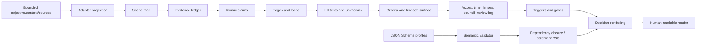
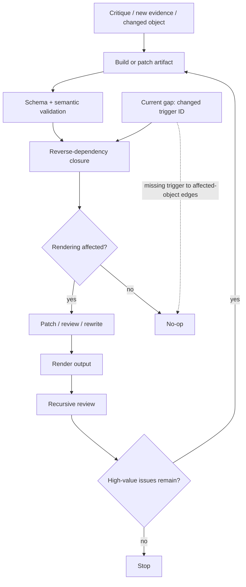
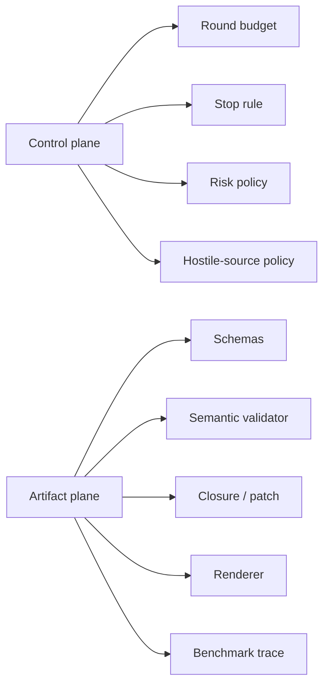

# OfOne Recursive Compiler Review

## Executive summary

The attached review prompt describes a **v0.5 recursive compiler review**, but the **public implementation I could inspect** is still consistently labeled **v0.4** in the GitHub repository, package metadata, examples, and GitHub Pages lifecycle text. That version skew is not a small editorial detail; it means any claim that a public **v0.5 implementation** exists is not currently supported by the inspected public sources. The prompt itself should therefore be treated as **local context about an intended or in-progress v0.5 review process**, while the repository and Pages are the authoritative public evidence about the shipped skillchain as of this inspection. fileciteturn0file0 citeturn41view0turn19view0turn42view0turn40view0

Architecturally, OfOne is more disciplined than a typical prompt-only framework. Public sources consistently describe it as an **artifact-first typed causal-geometry compiler** whose compile loop is: objective/context/sources → draft artifact objects → validate schema and semantic graph → repair failures → render the smallest safe answer → record patch triggers and benchmark trace. The public docs and code also show real structure around **profile dispatch**, **closed-world schema checks**, **stable diagnostic codes**, **reverse-dependency closure**, **adapter contracts**, and **review-log requirements for approved Audit gates**. Those are meaningful strengths. citeturn31view0turn42view0turn44view0turn29view0turn29view3turn25view9turn26view0turn15view0

The main technical conclusion is that **termination at the graph level is reasonably well-behaved, but termination at the recursive review level is not formally controlled**. The reverse-dependency closure implementation uses a finite breadth-first traversal with a `seen` set, so it terminates on finite graphs even with cycles. By contrast, the recursive review prompt and Pages language rely on a **subjective stop rule** such as “continue until no high-value recommendations remain,” without a hard iteration cap, explicit objective function, or monotonic convergence metric. That makes prompt-level recursion vulnerable to drift, re-litigation, and endless “improvement” churn. fileciteturn0file0 citeturn22view0turn42view0turn31view0

The most important correctness findings are concentrated in **update semantics**. Public docs define five transition classes — `no_op`, `patch`, `scoped_rerun`, `trunk_rewrite`, and `human_review` — but the patch helper’s `classifyTransition` function only returns **four** values and has **no `scoped_rerun` path at all**. More seriously, the dependency graph is built so that `affected_object -> trigger` edges exist, but not `trigger -> affected_object` edges. As a result, patch analysis started from a changed **trigger ID** is likely to under-report impact or even classify a trigger activation as a `no_op`, despite the operation description saying trigger activation should “patch all affected downstream dependencies.” The validator also reports dependency closure for triggers, but it does **not** validate whether a trigger’s declared transition actually matches the computed closure or review conditions. citeturn43view1turn25view3turn24view0turn22view0turn10view5turn7view4

The benchmark story is also materially weaker than the public framing suggests. The benchmark suite manifesto explicitly says OfOne must **not claim empirical superiority** until threshold conditions are met — including **21 total cases**, **3 cases per family**, **3 runs per case per arm**, **2 model families**, and **published failure analysis**. But the benchmark checker script only verifies **manifest completeness and file existence**. It does not check published run results, failure analyses, score thresholds, or the superiority gate. It also allows a case that includes the `full_ofone` arm to have `ofone_artifact: null`, because artifact existence is checked only if the field is present. In plain terms: the benchmark guardrail exists textually, but not yet operationally. citeturn17view2turn18view0turn35view0turn40view0

Security risk is **medium at the prompt/agent layer** and **lower at the inspected CLI-code layer**. The reviewed scripts are overwhelmingly local-file and schema/graph oriented, and one positive control is especially important: the validator explicitly **does not trust `validator_result` self-attestation**. But the recursive-review prompt and public skill/docs do not define an explicit **hostile-source protocol** for instructions embedded in repo pages, evidence extracts, or linked material. That leaves room for classic prompt-injection failure modes in an autonomous agent setting, especially because the system is designed to read public artifacts, form traces, and recurse over its own outputs. A secondary issue is that the current adapter gate-coverage check can be satisfied by generic gate text containing “review,” which is too weak for high-consequence exposure categories. fileciteturn0file0 citeturn25view9turn44view0turn31view0turn37view0turn36view4turn36view5

## Sources inspected and evaluation basis

I could read the **single attached file** in-chat, and I used it as the basis for all **local-context facts** in this report. No private connected sources were available to inspect in this session. Publicly, I inspected the repository root, the default branch page, the specific commit `18c9bc2`, the README, SKILL, core docs, schemas, scripts, examples, benchmark manifest, invalid fixtures, and the GitHub Pages landing page. The Pages landing page was publicly readable; direct fetches of individual Pages-hosted Markdown endpoints returned tool-level 400 responses during this inspection, so the detailed docs were inspected from the GitHub repository copies instead. fileciteturn0file0 citeturn40view0turn34view0turn42view0turn33view0turn44view0turn43view1

| Category | What it means in this report | What I could verify |
|---|---|---|
| Local-context facts | Facts derived from the attached v0.5 review prompt / inline brief | The attachment was readable and establishes the intended review procedure, recursive loop, and local framing for the assignment. fileciteturn0file0 |
| Repo-observed facts | Facts directly grounded in public GitHub repository content | The public repo exists on `main`, shows 14 commits on the root page, and publicly exposes README, SKILL, docs, schemas, scripts, examples, benchmarks, and tests. citeturn40view0turn34view0 |
| Pages-observed facts | Facts directly grounded in the public GitHub Pages landing page | The Pages landing page is public and describes OfOne as a typed causal-geometry compiler with an artifact-first compile loop and recursive review framing. citeturn42view0 |
| Inferences | Conclusions I draw by comparing multiple public sources and the attached prompt | The strongest inferences are version skew, transition-model drift, benchmark under-enforcement, and trigger-activation under-analysis. These are not stated verbatim in one source, but they follow from side-by-side comparison of the docs, schemas, scripts, and suite manifest. citeturn41view0turn42view0turn24view0turn22view0turn35view0turn17view2 |
| Assumptions | Minimal assumptions introduced because code was inspected statically, not executed | Reproduction cases below are **code-derived** and should be locally executed before merging fixes. |
| Open gaps | Unsupported claims that still need local validation | I did not execute `npm run validate`, `npm run patch`, `npm run benchmark`, or `npm test` in a local clone; I also could not fetch individual Pages Markdown documents directly through the web tool. Any claim about a non-public v0.5 codebase remains unsupported here. citeturn33view0turn40view0 |

The most important scope note is the **version mismatch**. The attached assignment and brief are framed around **v0.5**, but the inspected public package metadata, examples, README language, and Pages lifecycle text all still identify the implementation as **0.4.0 / v0.4**. This means the public repo is best read as the current implementation baseline, while the attached prompt is best read as **review intent and local launch context**, not proof of public v0.5 behavior. fileciteturn0file0 citeturn41view0turn19view0turn42view0turn43view9

## Intended function and architecture

Public docs are consistent that OfOne is intended to act as an **artifact-first decision compiler**, not a prose-first answer generator. The skill text, GitHub Pages landing page, and README all describe the artifact as the source of truth and the visible answer as a rendering of validated compiler state. The artifact model spans a core IR — charter, adapter, scene, evidence, claims, unknowns, kill tests, edges, loops, options, triggers, gates, confidence model, and decision rendering — plus decision-lifecycle objects such as artifact identity, criteria, tradeoff surface, actors, temporal model, information value, lenses, council result, and review log. citeturn31view0turn42view0turn44view1turn40view0

The public compile loop is explicit and repeatable: **objective/context/sources → draft artifact objects → validate schema and semantic graph → repair failures → render the smallest safe answer → record patch triggers and benchmark trace**. The framework also defines three output profiles — Micro, Map, and Audit — with the dispatcher schema routing each valid example to exactly one profile based on `mode`. The schema-checker then verifies both dispatch and profile exclusivity, which is one of the strongest correctness properties currently implemented. citeturn31view0turn42view0turn14view0turn29view0turn44view0

The architecture below is synthesized from the public README, SKILL, Pages landing page, and architecture framing doc. citeturn31view0turn42view0turn44view1turn40view0

The “recursive compiler” aspect appears in two public places. The Pages landing page says **Deep Research critique becomes backlog, implementation, verification, resubmission, and convergence tracking**, and the attached prompt is organized around a recursive review-and-improve process with a soft convergence rule. So the intended architecture is not only a map compiler, but also a **self-revising review loop** in which critique feeds implementation and implementation feeds another critique pass. fileciteturn0file0 citeturn42view0

That design is conceptually strong when compared with unstructured prompting, because it separates **artifact state**, **validation**, **rendering**, and **patch impact**. It is especially notable that the repo includes a profile dispatcher, a schema checker for closed definitions and dependent fields, a semantic validator, a renderer, a patch analyzer, invalid test fixtures, and a benchmark manifest rather than relying only on a single monolithic instruction block. citeturn40view0turn44view0turn29view1turn29view3turn35view0turn20view0

## Recursion mechanisms, termination, and failure modes

At the implementation level, the key recursion-like mechanism is the **reverse-dependency closure**. `buildObjectIndex` constructs a map of typed object IDs plus reverse dependencies from evidence, claims, unknowns, kill tests, criteria, tradeoff surfaces, information value, temporal model, lenses, council results, review logs, edges, loops, options, triggers, gates, and explicit rendering dependencies. `dependencyClosure` then performs a breadth-first walk over those reverse dependencies using a `seen` set and a queue, returning the sorted set of downstream affected nodes. Because the queue is exhausted and nodes are only added once, the closure terminates on any finite artifact graph, even when the graph contains cycles. citeturn22view0

At the prompt level, termination is much weaker. The public Pages language frames recursive review as **critique → backlog → implementation → verification → resubmission → convergence tracking**, and the attached prompt uses a stop condition that depends on whether additional critiques still produce “high-value actionable recommendations.” That is a **heuristic**, not a proof of convergence. There is no public evidence of a maximum round count, capped critique budget, monotonic acceptance criterion, or a formal measure showing that each recursive pass reduces unresolved defects faster than it adds new work. In practice, that invites non-termination by standards inflation: each pass can justify another pass by discovering one more non-blocking imperfection. fileciteturn0file0 citeturn42view0turn31view0

A second termination problem is **transition-model drift**. Public docs define five transition classes — `no_op`, `patch`, `scoped_rerun`, `trunk_rewrite`, and `human_review` — and the validator accepts all five as legal trigger values. But the patch helper’s `classifyTransition` function only returns `trunk_rewrite`, `human_review`, `patch`, or `no_op`. There is no code path that returns `scoped_rerun`. That means one of the public system’s documented recursion-control states is currently **unreachable** from the patch analyzer, even though it remains part of the public contract. citeturn43view1turn25view3turn24view0

The most serious failure mode I found is a likely **trigger-directionality bug**. The graph builder stores reverse links from each `trigger.affected_object` **to** the trigger ID, which is useful if the changed thing is the evidence/claim/object and you want to know which trigger depends on it. But the patch helper accepts changed IDs directly from the CLI and then runs `dependencyClosure(changedIds, reverseDeps)`. If a changed ID is actually the **trigger ID** — which is exactly what `trigger_activation` and `trigger_deactivation` imply — there is no reverse edge from the trigger to its affected objects, so the closure can be empty or incomplete. Combined with the current `classifyTransition` rules, that means a trigger activation can be under-classified or even become `no_op`, despite the operation description saying activation should patch all downstream dependencies. citeturn10view3turn10view5turn22view0turn24view0

The recursive-failure picture is also visible in the validator. `validateTriggers` checks that each trigger transition is one of the allowed enum values, confirms referenced objects exist, computes dependency closure, and records that closure as a pass message. But it does **not** check whether the trigger’s declared transition is semantically consistent with the computed closure or with review conditions. So a trigger that claims `no_op` even when its closure reaches the rendering node can still pass structural validation. The invalid-fixture suite also appears not to include negative cases for transition-semantic mismatch, `scoped_rerun`, or dependency-closure disagreement. citeturn25view3turn7view4turn39view0turn39view1turn39view2turn39view3turn39view4

The following flow diagram shows the current public recursive behavior and where it fails. It is synthesized from the public docs and code paths cited above. citeturn31view0turn42view0turn22view0turn24view0

| Topic | Current public behavior | Recommended behavior | Why it matters | Evidence |
|---|---|---|---|---|
| Prompt-level recursion stop rule | “Continue while high-value recommendations remain” style heuristic | Add a hard round cap, issue budget, and exit contract based on blocking defects only | Prevents endless recursive review churn | fileciteturn0file0 citeturn42view0 |
| Transition taxonomy | Docs and validator include `scoped_rerun`; patch helper cannot emit it | Implement explicit `scoped_rerun` classification and tests | Restores contract consistency | citeturn43view1turn25view3turn24view0 |
| Trigger activation/deactivation | Patch helper likely under-reports impact when starting from trigger IDs | Add trigger-specialized expansion from trigger → affected objects → closure | Fixes likely false `no_op` / under-patching | citeturn22view0turn10view5turn24view0 |
| Trigger semantic validation | Transition enum checked, but semantic suitability is not | Fail validation when declared transition disagrees with computed closure / risk / review conditions | Prevents silent transition drift | citeturn25view3turn7view4turn39view0 |

## Security analysis

There are real **positive controls** in the inspected system. The validator computes its own result and explicitly warns when an artifact’s embedded `validator_result.passed` disagrees with the computed value, which prevents the most obvious self-attestation spoofing. The schemas and schema-checker also enforce **closed definitions**, dependent fields, and exact profile dispatch, which materially reduces schema drift and unvalidated shadow fields. Audit mode further requires review-log support for approved gates, and high-risk artifacts require at least one gate. These are strong foundations for a prompt-driven compiler. citeturn25view9turn44view0turn29view3turn29view4turn37view0turn26view0turn15view0

The highest security concern is **prompt injection at the agent layer**, not arbitrary code execution in the inspected Node scripts. The recursive-review prompt and public skill encourage the model to inspect public repo/docs/pages, ingest evidence text, and recurse over its own outputs, but the inspected prompt/skill/docs do not define an explicit policy like “treat all sourced text as untrusted content; never follow instructions found inside evidence, docs, or extracted text.” The system’s checks focus on structure, provenance, allowed source types, and review states; they do not appear to provide a first-class hostile-content or instruction-sanitization layer. In an autonomous agent setting, that can allow instructions embedded in README text, Pages text, or evidence extracts to contaminate later passes. This is an inference from what the public contract includes and omits, not a claim that such an exploit is already present in the repo. fileciteturn0file0 citeturn31view0turn44view0turn44view2

A related issue is **data exfiltration and redaction discipline**. Audit-mode evidence requires content hashes, retrieval markers, source owner, chain of custody, and permission fields, and the movement economy explicitly includes human gates for permission and redaction. That is good governance metadata. But the inspected validation model is still mostly **structural**, not a content-security engine. I did not find a public redaction pipeline or sensitivity-aware renderer in the inspected materials, and the CLI validator can write its computed result directly back into the artifact with `--write`. If an autonomous recursive workflow were fed sensitive material, the current public contract appears to rely primarily on procedural discipline and human gates, not on automatic secret scrubbing. citeturn14view2turn31view0turn44view0turn36view1turn21view3

The current **gate-coverage heuristic** is also too permissive for high-consequence categories. Adapter contracts define required gate-trigger terms such as legal, medical, financial, rights, compliance, employment, and reputation exposures. But the validator’s `validateAdapterGateCoverage` routine derives expected exposures by simple text matching over objective/scope/stakes/claims/recommendation, and then marks coverage as present if gate text names the exposure **or merely contains the word “review.”** That means a generic gate can satisfy exposure coverage without naming the actual exposure class. The residual risk here is false assurance: the system can say gate coverage is present when the gate is too vague to support real governance. citeturn36view4turn37view0turn31view0

| Attack surface | Current public control | Residual risk | Recommended mitigation | Evidence |
|---|---|---|---|---|
| Prompt injection through docs/evidence text | Structural validation, provenance fields, human gates | Medium | Add explicit hostile-source rules and quote-sandboxing for evidence/docs text | fileciteturn0file0 citeturn31view0turn44view0turn44view2 |
| Self-attested validator status | Validator recomputes result and warns on mismatch | Low | Keep; upgrade mismatch from warning to fail in CI for released artifacts | citeturn25view9turn44view0 |
| Sensitive artifact mutation | `ofone-validate --write` mutates input file in place | Medium | Default to dry-run, write to sidecar file, require explicit `--in-place` | citeturn36view1turn21view3 |
| Exposure-to-gate coverage | Keyword heuristic; generic “review” can satisfy coverage | Medium | Replace with typed exposure classes and explicit gate bindings | citeturn36view4turn37view0 |

## Correctness and robustness issues

The public benchmark flow is the clearest case where declared intent outruns operational enforcement. The benchmark suite manifest says OfOne must not claim superiority until minimum conditions are met: **3 cases per family, 21 total cases, 3 runs per case per arm, 2 model families, and published failure analysis**. But the benchmark checker only verifies required arms, families, metrics, and file existence. It does not check result files, score distributions, run counts, publication of failure analyses, or superiority thresholds. So a repository can satisfy `npm run benchmark` while still being nowhere near the public no-superiority gate. That is a correctness issue because the benchmark script’s pass/fail output can be mistaken for empirical readiness. citeturn17view2turn35view0turn40view0

There is also a concrete manifest inconsistency: the suite requires every case to include the three arms `direct_answer`, `light_structured`, and `full_ofone`, but the case `case-scientific-mechanism-check-001` sets `ofone_artifact` to `null`. The benchmark checker allows this because it only calls `checkFile` when `item.ofone_artifact` is truthy. In other words, the suite can present a case as supporting the full-OfOne arm while omitting the very artifact that public docs describe as a required output for that arm. citeturn17view0turn18view0turn35view0

A subtler correctness issue is the mismatch between **implicit closure dependencies** and **explicit rendering dependencies**. The reverse-dependency graph automatically routes artifact identity, tradeoff surface, temporal model, information-value objects, lenses/council, and review-log entries into rendering closure when present. But the validator only requires explicit `decision_rendering.depends_on` references for missing objects, blocking unknowns, and the tradeoff surface. It does not appear to require explicit rendering dependencies for the other lifecycle objects that the closure engine already treats as rendering-relevant. This creates a drift risk: the visible `depends_on` list can understate what the patch logic actually treats as rendering-critical, which weakens trace completeness and makes renderer output easier to misread. citeturn22view0turn38view1turn26view0

The gate-coverage heuristic is another robustness weakness, especially in regulated or reputational settings. Because exposure detection is keyword-based and coverage can be satisfied by any gate text containing “review,” the system can produce **false positive governance coverage**. That weakness is not catastrophic if human reviewers already understand the intended exposure taxonomy, but it is exactly the kind of brittle string-level behavior that fails when third parties rely on the artifact instead of its author. citeturn36view4turn37view0

The public test suite does cover several important failure classes — missing evidence hash, schema drift from extra fields, illegal edge relation, missing information value for rendering-blocking unknowns, insufficient lens coverage, missing actors, missing gates, adapter mismatch, unresolved unknowns, and missing review logs. That is a real strength. But the absence of negative cases for **trigger semantic mismatch**, **`scoped_rerun` behavior**, and **trigger-activation closure correctness** leaves the highest-risk update-path bugs effectively unguarded. citeturn20view0turn20view2turn20view4turn39view0turn39view3

The following reproduction table is **code-derived** rather than execution-confirmed. It should be treated as a targeted local validation plan.

| Issue | Reproduction case | Expected correct behavior | Likely current behavior | Priority | Basis |
|---|---|---|---|---|---|
| Trigger activation underreports impact | `node scripts/ofone-patch.mjs examples/strategy-micro.json --operation trigger_activation T1` | Closure should include `E1` and downstream rendering impact because `T1` targets `E1` and the rendering depends downstream from evidence/claims | Closure is likely empty or incomplete because reverse deps are stored as `affected_object -> trigger`, not `trigger -> affected_object` | Critical | citeturn19view4turn22view0turn10view5turn24view0 |
| Declared trigger transition not semantically checked | Change `examples/strategy-micro.json` so `T1.transition = "no_op"` and run validation | Validation should fail or at least warn that closure reaches rendering and `no_op` is inconsistent | Validation likely still passes transition enum and only reports closure as an informational pass | High | citeturn25view3turn7view4turn39view0 |
| `scoped_rerun` impossible | Run patch analysis on a change that should recompute a bounded subgraph or lens set | Patch helper should return `scoped_rerun` when docs say bounded recomputation is necessary | Helper cannot return `scoped_rerun` at all | High | citeturn43view1turn24view0 |
| Benchmark pass without empirical readiness | Run `npm run benchmark` on the current manifest | Should fail empirical readiness if superiority minimums or released results are missing | Checker only validates manifest structure and file presence | High | citeturn17view2turn35view0 |
| Full-OfOne arm without artifact | Run benchmark checker on current suite | A case including `full_ofone` should require an artifact reference | `ofone_artifact: null` is allowed when the field is absent/truthy check fails | High | citeturn18view0turn35view0 |
| Gate coverage false positive | Create a regulated/high-risk artifact with a vague gate that only says “review” | Coverage should require explicit named exposure classes | Generic “review” can satisfy adapter gate coverage | Medium | citeturn36view4turn37view0 |

## Recommended fixes and alternative designs

The central design recommendation is to **convert the recursive review loop from an open-ended critique ritual into a bounded state machine**. The public model is already close to this: it has named transitions, artifact state, validators, patch reports, and review logs. The missing step is to make recursive improvement a first-class object with explicit budgets and exits. A small `review_cycle` object or sidecar record should track: starting artifact ID, critique set, accepted fixes, rejected fixes with reasons, unresolved blocking defects, round number, and stop reason. That would move convergence from prose to state. fileciteturn0file0 citeturn42view0turn31view0

The second major recommendation is to **unify the transition contract across docs, validator, patch helper, and tests**. Today, docs and validator allow `scoped_rerun`, but patch classification does not. The right repair is not just to add one missing return branch; it is to define a typed transition decision procedure. For example: boundary/objective/criteria/adapter/regime changes → `trunk_rewrite`; trigger or leaf-object changes whose closure stays inside a bounded object family → `patch`; bounded subgraph recomputation touching adapter axes, lens sets, or scene-local decomposition without trunk changes → `scoped_rerun`; and risk/gate/approval thresholds → `human_review`. That procedure should be shared across validator and patch analyzer, then exercised by dedicated negative and positive fixtures. citeturn43view1turn24view0turn25view3

For the trigger-directionality bug, the cleanest fix is to **model trigger semantics in both directions**. Either add forward links from trigger IDs to their affected objects for patch analysis, or special-case `trigger_activation` / `trigger_deactivation` so the patch helper expands a changed trigger into its `affected_objects` before computing closure. That preserves the current reverse-dependency model while fixing the operational bug with minimal schema churn. If OfOne later grows a full artifact rewriter, it may be cleaner to promote triggers into typed events with both activation effects and dependency edges. citeturn22view0turn10view5turn24view0

For explicit traceability, I recommend adding a **first-class benchmark trace / review trace object** rather than continuing to describe benchmark-trace logging only in the skill text and Pages loop. The public skill and Pages say to record benchmark trace, but the inspected schemas do not surface benchmark fields and the package scripts do not expose a dedicated trace writer. Make trace emission explicit: `benchmark_trace = { mode, validator_passed, diagnostic_codes, patch_count, render_mode, gate_blocked, transition_class }`. That will also make recursive-review outcomes analyzable rather than anecdotal. citeturn31view0turn42view0turn44view3turn31view1

For governance safety, the existing keyword-based gate coverage should be replaced by **typed exposure classes**. Instead of inferring exposures from free text and then considering “review” sufficient, represent exposure classes explicitly on claims, criteria, options, or artifact identity. Then require gate bindings to cover those exposure classes by ID. This both reduces false positives and makes the human-governance layer visible in patch closure and rendering dependencies. citeturn36view4turn37view0turn31view0

A helpful alternative design, if the project wants to stay prompt-centric rather than runtime-heavy, is a **two-plane architecture**:

The control plane should govern recursion, security, and release policy. The artifact plane should govern structure, closure, and rendering. Right now, the artifact plane is much more mature than the control plane. fileciteturn0file0 citeturn31view0turn42view0turn44view0

| Current behavior | Recommended behavior | Benefit | Evidence |
|---|---|---|---|
| Soft “continue while useful” recursion | Explicit max rounds, max patch budget, stop reason, and blocking-defect threshold | Reliable termination and easier audits | fileciteturn0file0 citeturn42view0 |
| Docs mention `scoped_rerun`, helper cannot emit it | Shared transition engine used by validator and patch helper | Removes contract drift | citeturn43view1turn24view0 |
| Trigger change starts from trigger ID with incomplete closure semantics | Expand trigger IDs to affected objects before closure | Correct update analysis | citeturn22view0turn10view5 |
| Benchmark readiness gated only in prose/manifest | Enforce superiority minimums and published result artifacts in the checker | Stops premature benchmark claims | citeturn17view2turn35view0 |
| Benchmark trace promised but not first-class | Add typed `benchmark_trace` / `review_cycle` record | Makes recursive evaluation measurable | citeturn31view0turn42view0turn31view1 |
| Free-text exposure coverage heuristic | Typed exposure classes and explicit gate bindings | Better security and governance fidelity | citeturn36view4turn37view0 |

## Prioritized action list

| Priority | Fix | Why first | Effort |
|---|---|---|---|
| Critical | Fix trigger activation/deactivation closure so changed trigger IDs expand to `affected_objects` before downstream closure analysis | Current patch helper can likely misclassify trigger changes as low-impact or `no_op`, which breaks the heart of recursive update logic | Medium |
| Critical | Implement `scoped_rerun` in patch classification and align docs, validator, and tests | Public contract already includes it, but current helper cannot produce it | Medium |
| High | Add semantic validation that declared trigger transitions match computed closure / review conditions | Prevents structurally valid but semantically wrong update logic | Medium |
| High | Harden benchmark checker so it enforces superiority thresholds, result publication, and failure-analysis availability | The current checker can pass while public no-superiority conditions are unmet | Medium |
| High | Require `ofone_artifact` for any case that includes the `full_ofone` arm | Fixes a concrete benchmark-manifest inconsistency already present in the suite | Low |
| High | Add a first-class `benchmark_trace` or `review_cycle` object to schema and tooling | Converts recursive-review and benchmark claims into machine-auditable state | Medium |
| Medium | Replace keyword-based gate coverage with typed exposure classes and explicit gate bindings | Reduces false governance positives and improves auditability | High |
| Medium | Add an explicit hostile-source / prompt-injection policy to the recursive review prompt and SKILL | Hardens the agent layer against instruction capture from docs/evidence text | Low |
| Medium | Require greater explicit completeness for `decision_rendering.depends_on`, or generate it canonically from the graph | Keeps visible trace aligned with actual patch semantics | Medium |
| Medium | Make `--write` opt into sidecar or snapshot output by default instead of in-place artifact mutation | Reduces accidental state corruption in autonomous loops | Low |

Overall, the public OfOne skillchain looks like a serious attempt to move from “prompting” to **typed, reviewable compiler state**, and that is the right direction. Its public strengths are real: artifact-first semantics, profile dispatch, closed-world schemas, computed validator results, dependency closure, and structured diagnostics. But the recursive part of the design is not yet equally mature. Publicly documented recursion and benchmark semantics outrun their operational enforcement in several places, and the most important update-path bug — trigger activation analysis from trigger IDs — should be treated as a release-blocking issue for any system that depends on accurate patch classification. citeturn40view0turn44view0turn22view0turn24view0turn17view2turn35view0