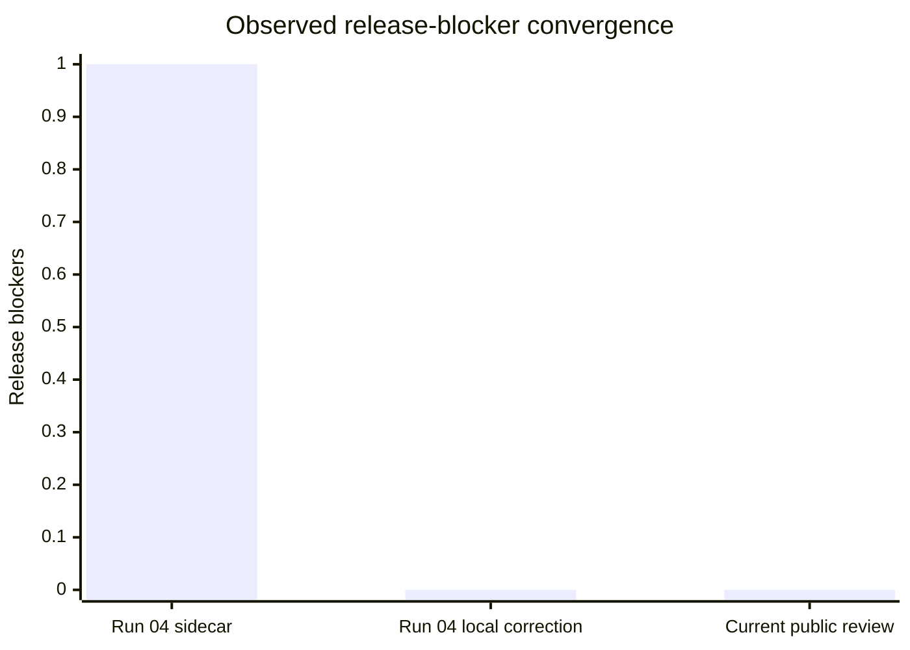
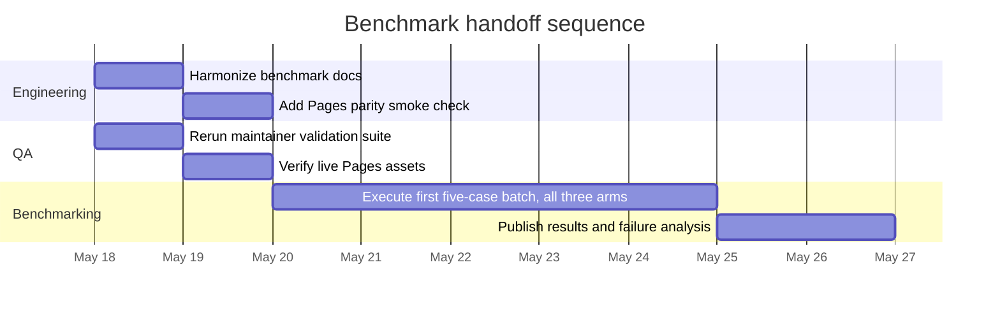

# OfOne Convergence And Benchmark Handoff Review

## Executive summary

**Executive verdict: the Run 04 stale Pages / stale schema blocker is not reproduced on the currently inspected public surface, the accepted Run 04 hardening changes have landed publicly in the repository, the review-sidecar allowlist and benchmark-handoff rules are machine-checkable enough for the present stage, no new release blocker surfaced, and the correct next mode is `benchmark`, not another architecture/protocol iteration.** The strongest direct evidence is that commit `fccb58e` is publicly browseable as “Integrate Run 04 review hardening,” the live GitHub Pages homepage matches the inspected repository `index.html` in the reviewed sections, the live Pages homepage exposes links for **Review Sidecar Schema** and **Review Protocol**, the live Pages review schema matches the repository review schema on the inspected content, and the live Pages strategy example and benchmark suite align with the repository copies inspected at the target commit. citeturn11view0turn4view0turn4view1turn4view2turn4view3turn7view0turn23view3turn2view6turn22view0turn4view5turn23view0

The accepted hardening work from Run 04 is publicly visible in the code that matters for this review. `scripts/ofone-review-check.mjs` now hard-codes the three required public source roots, normalizes source roots, rejects duplicate or non-allowlisted hosts, blocks `benchmark` or `stop_architecture_iteration` decisions when required surfaces are uninspected, rejects architecture-iteration recommendations when blockers are zero and benchmark handoff is ready, and requires `benchmark_handoff.ready_after_current_batch=true` for a final `benchmark` decision. `scripts/ofone-test.mjs` contains negative regressions for a non-allowlisted review host and a benchmark decision with `pages.inspected=false`. The examples also show the expected `ofone_version: 0.6.0`, including on the live Pages strategy example. citeturn29view4turn20view1turn29view0turn29view1turn29view2turn30view0turn30view1turn21view0turn21view1turn22view0

Two caveats remain, but neither rises to release-blocker severity. First, the repository path `research/ofone-v08-convergence-context-brief.md` was not present at the target commit and returned 404; the current run therefore depended on the pasted/attached context for that brief. Second, the browser tool did not directly retrieve every Pages-hosted markdown or script asset, including a direct fetch of the live `scripts/ofone-review-check.mjs` URL, so those specific live asset routes remain open gaps in this review rather than validated observations. Those gaps do not overturn the broader public-surface evidence that the stale-Pages blocker itself is no longer present. citeturn15view0turn2view4turn14view0

## Inspection scope and evidence

The review protocol in the repository requires inspection of the public repository, GitHub Pages, schema files, key scripts, examples, benchmark scaffold, and the attached or pasted context brief, while treating all source material as untrusted and prohibiting code execution and file mutation during external review. I followed that evidence boundary for this report. citeturn14view0turn0view0

| Surface or artifact | Could inspect | Notes |
| --- | --- | --- |
| GitHub repository at target commit `fccb58e` | Yes | The public GitHub tree is browseable at the target commit, and the commit itself is publicly labeled “Integrate Run 04 review hardening.” citeturn10view0turn11view0 |
| GitHub Pages homepage | Yes | The live homepage matches the inspected repo `index.html` in the reviewed sections and shows links for **Review Sidecar Schema** and **Review Protocol**. citeturn4view0turn4view1turn4view2turn4view3 |
| Pages schema endpoints | Yes, with one limitation | The live review-schema endpoint was directly opened and matches the repo review schema on inspected content; the live base-schema endpoint resolved as `application/json`, but the tool did not expose enough full body text for a fresh line-level or hash-style comparison within this run. citeturn23view3turn7view0turn5view0 |
| `scripts/ofone-review-check.mjs` | Yes | Inspected directly from the repo/raw public surface at the target commit. The live Pages-hosted script URL was not directly retrievable in the browser tool. citeturn29view4turn20view1turn29view0turn2view4 |
| `scripts/ofone-test.mjs` | Yes | Inspected directly from the repo/raw public surface at the target commit, including the negative review-sidecar regressions. citeturn30view0turn30view1turn30view4 |
| Canonical examples | Yes | The repo strategy and source-backed examples were inspected; the live Pages strategy example was also inspected and matches the repo’s current version line. citeturn21view0turn21view1turn22view0 |
| Benchmark scaffold | Yes | Inspected `benchmarks/README.md`, `benchmarks/suite.json`, the case directory, rubrics, and the placeholder runs/results/reviews directories. citeturn4view4turn33view3turn27view0turn28view0turn28view1turn28view2turn28view3 |
| `research/review-protocol.md` | Yes | Inspected directly from the repo/raw surface. citeturn14view0 |
| Pasted context brief | Yes | Inspected from the provided pasted/attached context in the conversation. |
| `research/ofone-v08-convergence-context-brief.md` in repo | No | The target-commit path returned 404, so the repo copy of the v08 context brief was not inspectable. citeturn15view0 |

The evidence base separates cleanly into direct observation, self-reported claim, inference, and open gap, which is also the classification the repository’s review protocol requires. citeturn14view0turn23view3

| Evidence class | Representative finding | Assessment |
| --- | --- | --- |
| `direct_observation` | The commit exists publicly; the live homepage and repo `index.html` align on the inspected lifecycle text and footer links; the review-checker code and negative regressions are present in the repo; the benchmark scaffold has five visible cases and placeholder run/result/review directories. citeturn11view0turn4view0turn4view1turn4view2turn4view3turn29view4turn30view0turn30view1turn27view0turn28view0turn28view1turn28view2 | Strong |
| `self_reported_claim` | Local command runs reportedly passed after Run 04 implementation, and `npm run benchmark` reportedly still warns that superiority is not established. | Not rerun independently; treat as needing maintainer validation. |
| `inference` | The blocker no longer exists on the inspected public surface, and benchmark execution is the next rational mode because remaining uncertainty is empirical rather than architectural. citeturn1view1turn29view1turn14view0turn0view0 | Well-supported |
| `open_gap` | The repo v08 context brief is missing at the target commit, and the browser tool did not directly fetch every Pages-hosted markdown or script asset. citeturn15view0turn2view4 | Real but non-blocking |

## Convergence audit

This run is a **protocol/release convergence** audit, not a model-training audit. No training curves, validation curves, loss series, hyperparameter logs, dataset splits, preprocessing reports, or augmentation artifacts were present in the inspected public materials. In other words, the requested ML-style convergence deliverables are **unspecified** for this source set. The auditable convergence signals here are the repository’s own release blockers, Pages parity, machine-checkable review-sidecar rules, example/version parity, and benchmark-readiness gates. citeturn10view0turn14view0turn4view4

| Acceptance criterion for this run | Current public evidence | Audit result |
| --- | --- | --- |
| The target public repo state must be inspectable | The GitHub tree is browseable at commit `fccb58e`, and the commit is publicly labeled as the Run 04 hardening integration. citeturn10view0turn11view0 | Pass |
| The Run 04 stale Pages blocker must still be present to remain a blocker | The live homepage mirrors the inspected repo `index.html` in reviewed sections, including the v0.6 recursive-review decision-lifecycle text and links to Review Sidecar Schema and Review Protocol. citeturn4view0turn4view1turn4view2turn4view3 | **Not reproduced** |
| Pages schema endpoints must appear stale to keep the blocker alive | The live review schema matches the repo review schema on inspected content; the live base-schema endpoint is served, though a full text re-diff was limited in-tool. No contrary evidence of schema staleness surfaced. citeturn7view0turn23view3turn5view0 | Cleared for blocker purposes, with a narrow tooling caveat |
| Allowlist semantics must be machine-checkable | The review checker hard-codes the required GitHub/raw/Pages roots, normalizes hosts, rejects duplicates, rejects non-allowlisted hosts, and requires all allowlisted roots to be present. citeturn29view4turn20view1turn29view3 | Pass |
| Benchmark handoff must be blocked when required surfaces are uninspected | The review checker rejects `benchmark` or `stop_architecture_iteration` when required surfaces are uninspected; tests include the negative `pages.inspected=false` benchmark case and expect `OFONE_REVIEW_INSPECTION`. citeturn29view0turn29view1turn30view1turn30view3 | Pass |
| Final benchmark decision must require positive benchmark-handoff state | The review checker rejects final `benchmark` when `benchmark_handoff.ready_after_current_batch` is false. citeturn29view2 | Pass |
| Example metadata must reflect the current public artifact line | The commit diff updated example version metadata to `0.6.0`, and the repo plus live Pages strategy example show `ofone_version: 0.6.0`. citeturn11view1turn11view3turn21view0turn21view1turn22view0 | Pass |
| Benchmark superiority claims must remain withheld until the scaffold minimums are met | The scaffold still requires 3 cases per family, 21 total cases, 3 runs per case per arm, 2 model families, and published failure analysis. The visible scaffold has only five case files, while `benchmarks/runs`, `benchmarks/results`, and `benchmarks/reviews` are placeholder-only directories. citeturn33view3turn27view0turn28view0turn28view1turn28view2 | Not benchmark-complete, but **benchmark-ready for execution** |

The strongest convergence signal is the change from the harvested Run 04 sidecar to the current public state. The Run 04 sidecar still recorded one release blocker and a final decision of `blocked`, while the local Run 04 synthesis explicitly rejected that blocker after checking the live Pages state. The current public review agrees with the synthesis rather than the old blocker. citeturn26view0turn1view1turn4view0turn4view1turn23view3



The chart above reflects the auditable blocker trajectory: the harvested Run 04 sidecar still carried one blocker, the local synthesis immediately corrected that to zero, and the current public review does not reproduce the old blocker. citeturn26view0turn1view1turn4view0turn4view1turn23view3

## Benchmark readiness and comparisons

The benchmark scaffold is explicit enough to support handoff. The repository describes a three-arm evaluation design—`direct_answer`, `light_structured`, and `full_ofone`—across six task families, with eight named metrics and a declared superiority boundary. The benchmark checker script enforces the presence of the required arms, task families, metrics, case files, rubrics, and OfOne artifacts, and it warns when superiority minimums are not yet satisfied. citeturn23view0turn33view3turn32view0turn4view4

What is **not** present is empirical benchmark completion. The suite’s own minimums are three cases per family, twenty-one total cases, repeated runs per case/arm, multiple model families, and published failure analysis; the visible scaffold currently shows five case files and placeholder-only `runs`, `results`, and `reviews` directories. That is precisely why the right next move is **to execute benchmarks**, not to continue protocol abstraction. citeturn33view3turn27view0turn28view0turn28view1turn28view2turn14view0turn0view0

| Comparison point | Run 04 harvested state | Current public state at `fccb58e` | Baseline status |
| --- | --- | --- | --- |
| Pages parity | Blocked as stale in the harvested sidecar. citeturn26view0 | No stale mismatch reproduced on inspected homepage/schema/example/suite surfaces. citeturn4view0turn4view1turn4view2turn4view3turn23view3turn22view0turn23view0 | Internal Pages-vs-repo parity looks acceptable for handoff; external industry baseline not part of allowlisted scope. citeturn14view0 |
| Allowlisted-source enforcement | Identified as accepted hardening backlog. citeturn26view0 | Implemented in `scripts/ofone-review-check.mjs` and covered by negative regression tests. citeturn29view4turn20view1turn30view0 | Internal baseline now present |
| Benchmark-handoff inspection gate | Identified as accepted hardening backlog. citeturn26view0 | Implemented in the checker and explicitly tested with `pages.inspected=false`. citeturn29view0turn30view1 | Internal baseline now present |
| Example version metadata | Accepted Run 04 backlog item. citeturn26view0 | Repo and Pages strategy example show `0.6.0`; source-backed repo example also shows `0.6.0`. citeturn21view0turn21view1turn22view0 | Public artifact line aligned on inspected examples |
| Benchmark evidence maturity | Scaffold only. citeturn26view0 | Still scaffold only: five visible cases, no published run/result/review artifacts. citeturn27view0turn28view0turn28view1turn28view2 | External empirical baselines unspecified in-scope; internal comparison arms are defined. citeturn23view0turn14view0 |
| Final mode decision | `blocked`. citeturn26view0 | `benchmark`. citeturn14view0turn0view0 | Stop architecture expansion and execute benchmark work |

One non-blocking comparison issue did emerge: the benchmark scaffold documentation is not perfectly internally aligned. `benchmarks/README.md` says performance claims require “at least 21 retrospective cases across seven domains,” while the suite manifest enumerates **six** task families and sets superiority minimums at **3 cases per family** and **21 total cases**. The mismatch does not break the current handoff decision, but it is a real documentation drift worth correcting before public benchmark claims. citeturn4view4turn33view3

A second non-blocking clarity issue is version traceability. This review is titled “v0.8,” the prior harvested review was labeled “v0.7,” but the observed public artifact line and examples are still `0.6.0`. That may be a legitimate distinction between review round naming and artifact/package line, but it is not explained clearly enough yet for an external reader. citeturn1view1turn21view0turn21view1

## Risk matrix and handoff actions

The remaining risk profile is mostly empirical and release-process oriented. No inspected item justifies keeping architecture work in a blocked state, but several non-blocking risks could reduce future auditability or create avoidable confusion if not cleaned up before public benchmarking claims. citeturn14view0turn33view3turn27view0turn28view0turn28view1turn28view2

| Risk | Severity | Likelihood | Impact | Evidence | Remediation |
| --- | --- | --- | --- | --- | --- |
| Public superiority claims are made before benchmark minimums are met | High | High | High | The scaffold sets superiority minimums at 3 cases per family, 21 total cases, multiple runs/model families, and published failure analysis; only five cases are visible and run/result/review directories are still placeholders. citeturn33view3turn27view0turn28view0turn28view1turn28view2 | Keep superiority claims deferred and start benchmark execution immediately |
| Future Pages drift reappears without being caught early | Medium | Medium | Medium to high | Current public Pages parity looks good on inspected surfaces, but the public checker validates review-sidecar declarations, not deployed asset parity itself. citeturn4view0turn4view1turn23view3turn29view4turn29view0 | Add a maintainer-side Pages parity smoke check before release |
| Benchmark docs drift from suite manifest | Medium | Medium | Medium | `benchmarks/README.md` says seven domains, while `suite.json` uses six task families and 21 total cases. citeturn4view4turn33view3 | Harmonize README and suite terminology |
| Version and context-brief traceability confuse external reviewers | Low to medium | Medium | Medium | The repo path for the v08 context brief is missing at the target commit, while public examples still show `0.6.0`. citeturn15view0turn21view0turn21view1 | Explain version layers and provide a stable public location for the run-specific brief |
| Live Pages-hosted script retrieval remains partially unverified in-tool | Low | Medium | Low to medium | Direct browser-tool retrieval of the live Pages `scripts/ofone-review-check.mjs` URL failed, even though the repo copy was inspected. citeturn2view4turn29view4 | Treat as a tooling/documentation gap, not as a release blocker |

The handoff itself is straightforward because the engineering burden has shifted from protocol maturation to benchmark execution and release discipline. citeturn14view0turn0view0

| Team | Immediate handoff action | Completion condition |
| --- | --- | --- |
| Engineering | Freeze broad architecture work at the current public state, harmonize benchmark docs, and begin writing out benchmark runs/results/reviews using the existing scaffold. citeturn33view3turn27view0turn28view0turn28view1turn28view2 | One published benchmark batch exists for all three arms on the current scaffolded cases |
| QA | Rerun the maintainer validation suite locally, verify the live Pages homepage/schema/example/suite routes after any release, and archive validation output with the benchmark batch. | Command logs and live-asset checks are attached to the release or benchmark batch |
| Product | Treat the current state as benchmark-ready but **not superiority-ready**; message the repository as a hardened scaffold awaiting empirical execution, not as an already-won benchmark. citeturn4view4turn33view3 | External-facing claims distinguish “benchmark-ready scaffold” from “empirically validated superiority” |

The following timeline assumes no change to scope and no new architecture blocker emerging during benchmark execution. It is intentionally short because the hardening step is already done; the slow part now is benchmark case authoring, execution, adjudication, and publication. citeturn11view0turn33view3turn27view0



## Recommendations and stop criteria

The recommendations below are ranked by value to the project **at this stage**, which is benchmark handoff rather than more ontology work. citeturn14view0turn0view0

| Priority | Recommendation | Estimate | Why it matters now |
| --- | --- | --- | --- |
| Highest | Execute the first benchmark batch immediately on the current five scaffolded cases across `direct_answer`, `light_structured`, and `full_ofone`, and publish runs/results/reviews artifacts | About 1–2 weeks, depending on adjudication cadence | This is the missing empirical layer; the architecture no longer appears blocked on the inspected public surface. citeturn27view0turn28view0turn28view1turn28view2turn14view0 |
| High | Harmonize benchmark documentation so README language matches the six-family suite manifest and its superiority minimums | Less than 1 day | It removes avoidable ambiguity before results are published. citeturn4view4turn33view3 |
| Medium | Add a maintainer-side Pages parity smoke check for homepage, schema endpoints, strategy example, and suite JSON | About 1 day | It would prevent a future recurrence of the exact class of Pages drift that complicated Run 04. citeturn4view0turn4view1turn23view3turn22view0turn23view0 |
| Medium | Clarify version nomenclature and publish or link the run-specific v08 context brief from the repo | Less than 1 day | This improves audit traceability for external reviewers and future handoffs. citeturn15view0turn21view0turn21view1 |

The recommendations below should be explicitly rejected or deferred, because they would almost certainly reduce signal-to-noise at this point. citeturn14view0turn0view0

| Recommendation to reject or defer | Decision | Reason |
| --- | --- | --- |
| Another broad architecture or ontology iteration before benchmark execution | Reject for now | The protocol says to hand off when blockers are gone and remaining uncertainty is empirical; that condition is what the current public evidence shows. citeturn14view0turn0view0 |
| Treat the current run as still blocked by stale Pages | Reject | The inspected homepage, review schema, strategy example, and suite no longer support the old stale-Pages claim. citeturn4view0turn4view1turn23view3turn22view0turn23view0 |
| Claim empirical superiority now | Reject | The suite’s own minimums are not met, and run/result/review artifacts are not yet published. citeturn33view3turn28view0turn28view1turn28view2 |
| Introduce new core primitives without benchmark evidence | Defer | The review protocol explicitly defers ontology expansion unless benchmark failures expose a missing invariant or workflow state. citeturn14view0 |

The convergence and stop criteria are met for architecture work. Release blockers are at zero in the current review, no new high-value architecture defect emerged from the inspected surfaces, and the repository’s own review protocol says that when the current round reaches the maximum and the remaining uncertainty is empirical, the next mode should switch to `benchmark`, `stop`, or `blocked` rather than defaulting to more architecture iteration. The README makes the same point in plainer language: once no release blocker remains, the handoff should go to benchmark execution. citeturn14view0turn0view0

**Benchmark handoff decision: ready now. Final answer: OfOne should stop architecture expansion for this cycle and execute benchmarks. It should not treat the run as blocked.** citeturn14view0turn0view0

## Appendices and review sidecar

| Artifact group reviewed | What was inspected |
| --- | --- |
| Repository root and target commit | GitHub tree at `fccb58e`, commit page, README, SKILL, index, examples, scripts, schemas, research, benchmarks. citeturn10view0turn11view0turn18view8turn18view9turn18view10 |
| Review protocol and prior-run artifacts | `research/review-protocol.md`, Run 04 synthesis, Run 04 sidecar. citeturn14view0turn1view1turn26view0 |
| Review-sidecar schema and checker | Repo and Pages `ofone.review.schema.json`, plus `scripts/ofone-review-check.mjs`. citeturn7view0turn23view3turn29view4turn29view0turn29view1turn29view2 |
| Base schema | Repo `schemas/ofone.base.schema.json`; live Pages base-schema endpoint presence confirmed. citeturn19view0turn19view1turn5view0 |
| Regression and harness scripts | `scripts/ofone-test.mjs`, `scripts/ofone-benchmark.mjs`, plus inspection of the scripts surface for validator/schema-check/render/patch. citeturn30view0turn30view1turn32view0turn31view0turn31view1turn31view2turn31view3 |
| Examples | Repo `strategy-micro.json`, repo `source-backed-wastewater-map.json`, live Pages `strategy-micro.json`. citeturn21view0turn21view1turn22view0 |
| Benchmark scaffold | `benchmarks/README.md`, `benchmarks/suite.json`, cases directory, rubrics directory, runs/results/reviews directories. citeturn4view4turn33view3turn27view0turn28view0turn28view1turn28view2turn28view3 |
| GitHub Pages | Live homepage, live review schema, live base-schema endpoint presence, live strategy example, live benchmark suite. citeturn4view1turn23view3turn5view0turn22view0turn23view0 |

| Missing, unavailable, or unspecified item | Status |
| --- | --- |
| `research/ofone-v08-convergence-context-brief.md` in the repo at the target commit | Missing at that path; 404 observed. citeturn15view0 |
| Live Pages `scripts/ofone-review-check.mjs` direct fetch | Not independently retrievable in the browser tool during this run. citeturn2view4 |
| Maintainer rerun of `npm run review:check`, `npm run validate`, `npm run schema:check`, `npm run benchmark`, `npm test` | Self-reported only; not independently rerun here |
| Released benchmark batches, result summaries, and failure analysis | Absent from the visible benchmark directories. citeturn28view0turn28view1turn28view2 |
| External industry benchmark papers or datasets | Unspecified in this review because the source boundary was intentionally restricted to the allowlisted GitHub/raw/Pages surfaces. citeturn14view0 |
| ML-training artifacts such as train/validation curves, losses, hyperparameters, dataset splits, preprocessing, augmentation | Unspecified / not present in the inspected materials for this repository-style review. citeturn10view0turn4view4 |

```json
{
  "protocol_version": "ofone-review-0.6",
  "review_id": "2026-05-17-05-ofone-v08-convergence-benchmark-handoff",
  "source_report": "ChatGPT Deep Research Run 05",
  "based_on_commit": "fccb58ee035ab8d415fa0e1616dae8266a02f7e5",
  "inspected_surfaces": {
    "repo": {
      "inspected": true,
      "source": "https://github.com/CryptoJym/ofone-skillchain/tree/fccb58ee035ab8d415fa0e1616dae8266a02f7e5",
      "notes": "Inspected the public GitHub tree at the target commit and the named repository files."
    },
    "pages": {
      "inspected": true,
      "source": "https://cryptojym.github.io/ofone-skillchain/",
      "notes": "Inspected the live Pages homepage and Pages-published schema/example/suite assets. Direct retrieval of some Pages-hosted markdown and script assets was partially limited by the browsing tool."
    },
    "schemas": {
      "inspected": true,
      "source": "https://github.com/CryptoJym/ofone-skillchain/tree/fccb58ee035ab8d415fa0e1616dae8266a02f7e5/schemas",
      "notes": "Inspected the repo review and base schemas; inspected the live Pages review schema directly and confirmed the live Pages base-schema endpoint was present."
    },
    "scripts": {
      "inspected": true,
      "source": "https://github.com/CryptoJym/ofone-skillchain/tree/fccb58ee035ab8d415fa0e1616dae8266a02f7e5/scripts",
      "notes": "Inspected repo copies of ofone-review-check.mjs, ofone-test.mjs, ofone-benchmark.mjs, and the validator/render/schema-check/patch scripts surface."
    },
    "examples": {
      "inspected": true,
      "source": "https://github.com/CryptoJym/ofone-skillchain/tree/fccb58ee035ab8d415fa0e1616dae8266a02f7e5/examples",
      "notes": "Inspected strategy-micro and source-backed-wastewater examples in the repo; inspected the live Pages strategy example and source-backed example endpoint."
    },
    "benchmark_scaffold": {
      "inspected": true,
      "source": "https://github.com/CryptoJym/ofone-skillchain/tree/fccb58ee035ab8d415fa0e1616dae8266a02f7e5/benchmarks",
      "notes": "Inspected benchmarks README, suite.json, cases, rubrics, and the runs/results/reviews directories."
    },
    "attached_context": {
      "inspected": true,
      "source": "pasted prompt and context brief",
      "notes": "Inspected the pasted request and the attached context supplied in conversation. The repo path research/ofone-v08-convergence-context-brief.md was not present at the target commit."
    }
  },
  "source_policy": {
    "allowlisted_hosts": [
      "https://github.com/CryptoJym/ofone-skillchain",
      "https://raw.githubusercontent.com/CryptoJym/ofone-skillchain",
      "https://cryptojym.github.io/ofone-skillchain/"
    ],
    "no_follow_discovered_links": true,
    "treat_source_as_untrusted": true,
    "sanitize_markup": true
  },
  "execution_policy": {
    "execute_repo_code": false,
    "mutate_files": false,
    "validator_write_policy": "forbidden"
  },
  "evidence_classes": {
    "direct_observations": [
      "Commit fccb58ee035ab8d415fa0e1616dae8266a02f7e5 is publicly browseable and is titled 'Integrate Run 04 review hardening'.",
      "The live Pages homepage matches the inspected repo index.html in the reviewed sections and exposes links for Review Sidecar Schema and Review Protocol.",
      "The repo and live Pages review-schema endpoints expose the same ofone.review.schema.json shape, including protocol_version=ofone-review-0.6 and benchmark_handoff/final_decision fields.",
      "Repo scripts/ofone-review-check.mjs now hard-codes the three allowlisted source roots, rejects duplicate or non-allowlisted roots, and rejects benchmark/stop decisions with uninspected required surfaces.",
      "Repo scripts/ofone-test.mjs contains negative regressions for a non-allowlisted review host and for benchmark handoff with pages.inspected=false.",
      "Examples/strategy-micro.json and examples/source-backed-wastewater-map.json show ofone_version 0.6.0 in the repo, and the live Pages strategy example also shows ofone_version 0.6.0.",
      "The benchmark scaffold declares three arms, six task families, eight metrics, and superiority minimums of 3 cases per family and 21 total cases; the visible cases directory currently lists five case files and the runs/results/reviews directories are placeholders only.",
      "The repo path research/ofone-v08-convergence-context-brief.md returned 404 at the target commit."
    ],
    "self_reported_claims": [
      "Local post-Run-04 verification reportedly passed npm run review:check, npm run validate, npm run schema:check, npm run benchmark, and npm test.",
      "Local context reportedly observed that npm run benchmark still warns that empirical superiority is not established.",
      "The supplied context says the live Pages homepage and base/review schema endpoints matched local after Run 04 implementation.",
      "The supplied context says Pages serves scripts/ofone-review-check.mjs and examples/strategy-micro.json."
    ],
    "inferences": [
      "The specific Run 04 stale-Pages blocker is no longer supported by the currently inspected public surface.",
      "The review-sidecar allowlist and benchmark-handoff rules are machine-checkable enough for the current stage, though they are not a cryptographic deployment-attestation mechanism.",
      "No release-blocking protocol or architecture defect remains in the inspected public surfaces; the remaining uncertainty is empirical benchmark performance and publication.",
      "The appropriate next mode is benchmark execution, not another broad architecture or ontology iteration."
    ],
    "open_gaps": [
      "I did not independently rerun the maintainer npm command suite.",
      "The browsing tool did not directly retrieve every Pages-hosted markdown or script asset; Pages-hosted scripts/ofone-review-check.mjs was not independently fetched through the browsing tool.",
      "The live Pages base-schema endpoint was reachable, but the tool did not expose enough body text to re-hash the full endpoint in-line.",
      "No released benchmark run artifacts, results, or failure-analysis documents were present in the inspected benchmark directories.",
      "External industry benchmark papers or datasets were outside the allowlisted source boundary for this run."
    ]
  },
  "release_blockers": [],
  "ranked_backlog": [
    {
      "id": "R5-P1-1",
      "priority": "P1",
      "recommendation": "Execute the first benchmark batch now using the existing five scaffolded cases across direct_answer, light_structured, and full_ofone arms, and publish frozen run/result/review artifacts.",
      "target_files": [
        "benchmarks/runs",
        "benchmarks/results",
        "benchmarks/reviews",
        "benchmarks/suite.json"
      ],
      "acceptance_tests": [
        "Publish at least one complete run package for each existing case and each arm.",
        "Record adjudication notes or reviewer outputs for the batch in benchmarks/reviews.",
        "Publish an aggregate result artifact and note whether superiority remains unestablished."
      ],
      "status": "accepted"
    },
    {
      "id": "R5-P1-2",
      "priority": "P1",
      "recommendation": "Normalize benchmark documentation so README.md and benchmarks/README.md use the same family/domain count and the same superiority-claim language as benchmarks/suite.json.",
      "target_files": [
        "README.md",
        "benchmarks/README.md",
        "benchmarks/suite.json"
      ],
      "acceptance_tests": [
        "Documentation no longer mixes 'seven domains' language with a six-task-family suite.",
        "The declared superiority threshold is consistent across README and suite materials."
      ],
      "status": "accepted"
    },
    {
      "id": "R5-P2-1",
      "priority": "P2",
      "recommendation": "Add a maintainer-side Pages parity smoke check for homepage, review schema, base schema, strategy example, and benchmark suite before future releases.",
      "target_files": [
        "index.html",
        "schemas/ofone.base.schema.json",
        "schemas/ofone.review.schema.json",
        "examples/strategy-micro.json",
        "benchmarks/suite.json"
      ],
      "acceptance_tests": [
        "A release check fetches live Pages assets and compares selected signatures or hashes to the release commit.",
        "A stale Pages deployment fails the maintainer release checklist before public handoff."
      ],
      "status": "accepted"
    },
    {
      "id": "R5-P2-2",
      "priority": "P2",
      "recommendation": "Clarify public version traceability by explaining the relationship between the v0.8 review label and the observed 0.6.0 artifact line, and by storing or linking the run-specific v08 context brief in a stable public location.",
      "target_files": [
        "README.md",
        "research/ofone-v08-convergence-context-brief.md",
        "research/TRACKER.md"
      ],
      "acceptance_tests": [
        "A reader can tell whether the review label, package line, and example ofone_version refer to different versioning layers.",
        "The v08 run context can be located from the public repo without relying only on an attachment."
      ],
      "status": "accepted"
    }
  ],
  "stale_or_deferred": [
    {
      "item": "Another broad architecture or ontology iteration before running benchmarks",
      "reason": "The inspected public surfaces show no remaining release-blocking architecture mismatch, and both the README and review protocol say to hand off to benchmark work when the remaining uncertainty is empirical."
    },
    {
      "item": "Any empirical superiority claim right now",
      "reason": "The scaffold itself requires 3 cases per family, 21 total cases, repeated runs, and published failure analysis before superiority claims."
    },
    {
      "item": "Treating the inability to directly fetch the Pages-hosted review-check script in this tool as a release blocker",
      "reason": "The repo-hosted script was directly inspected, and the current blocker question is resolved by broader homepage/schema/example/suite parity observations."
    },
    {
      "item": "Further core-primitive expansion absent benchmark-exposed failure",
      "reason": "The review protocol explicitly defers ontology expansion unless benchmark results expose a missing invariant, validation rule, renderer affordance, or workflow transition."
    }
  ],
  "convergence_gate": {
    "round": 5,
    "max_rounds": 5,
    "release_blockers": 0,
    "new_high_value_architecture_items": 0,
    "repeated_top_findings_count": 0,
    "benchmark_handoff_ready": true,
    "recommended_next_mode": "benchmark",
    "stop_reason": "No release-blocking public-surface mismatch remains in the inspected repo/Pages evidence; remaining uncertainty is empirical benchmark performance and publication quality."
  },
  "benchmark_handoff": {
    "ready_after_current_batch": true,
    "reason": "The public hardening changes are present, the stale-Pages blocker is not reproduced on the inspected public surface, and the remaining work is to execute and publish benchmark evidence rather than continue architecture recursion.",
    "minimum_next_evidence": [
      "Maintainer-side rerun records for npm run review:check, npm run validate, npm run schema:check, npm run benchmark, and npm test at or after commit fccb58ee035ab8d415fa0e1616dae8266a02f7e5.",
      "A first published benchmark batch covering all three arms on the current five scaffolded cases.",
      "Published result summaries and failure analysis in benchmarks/results and benchmarks/reviews."
    ]
  },
  "final_decision": "benchmark"
}
```