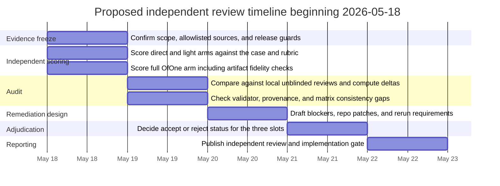

# Independent Review of OfOne Batch 01 Slice

## Executive summary

This report begins the independent review described in the uploaded Deep Research request and the public Batch 01 handoff/context: a narrow review of the first `agentic_coding` slice for `case-strategic-gated-diligence-001`, covering the three reviewed arms `direct_answer`, `light_structured`, and `full_ofone`, rather than a broad reassessment of OfOne’s overall architecture. The public execution matrix lists 90 predeclared run slots, of which only three have been locally reviewed so far. fileciteturn0file0 citeturn1view3turn2view0turn0view3

The independent adjudication is straightforward. The `direct_answer` run should remain accepted for later aggregate scoring, and the `light_structured` run should also remain accepted. Both outputs satisfy their arm prompts, correctly block operational launch, distinguish key gaps and gate conditions, and avoid superiority overclaims. By contrast, the `full_ofone` run should **not** remain accepted. Its raw output explicitly says the artifact is a copied example artifact, and the artifact itself still names a wastewater market-entry objective and a different case identity rather than the benchmark case under review. That is a case-fidelity failure, not a minor formatting issue. citeturn6view2turn6view3turn3view0turn3view1turn3view2turn12view0turn4view0turn7view0

The largest review-quality problem is not broad methodological overclaiming but **method favoritism in the local unblinded review of the `full_ofone` arm**. The local review rewarded trace structure, audit artifacts, and patch mechanics, but it did not treat copied-example reuse and benchmark-case mismatch as a reject-level defect. In effect, it scored the richness of the formal machinery more heavily than whether the machinery was actually bound to the right benchmark input. citeturn5view2turn3view2turn12view0turn4view0turn1view1

The first-slice review process is **adequate with conditions only**. It deserves credit for freezing a batch plan, documenting release guards, and explicitly preparing an independent frontier review before broader execution. But Batch 01 should not continue to broader execution until the repository adds benchmark-case binding checks, an explicit pre-score auto-reject screen, and immutable machine-generated validation artifacts for full-OfOne runs. **This should trigger implementation changes before the next benchmark slice.** **No empirical superiority claim is supported**: the suite itself requires substantially more evidence before such a claim is allowed, and the public batch files still mark the results as in progress with no aggregate scoring completed. citeturn0view1turn0view2turn0view3turn11view0turn11view1turn13view0

## Scope, objectives, and success criteria

The governing objective is to evaluate the first Batch 01 benchmark slice and the local unblinded reviews; determine whether the benchmark workflow is ready to continue; specify concrete repository changes required before broader execution; and decide whether the three reviewed run slots should remain accepted for later aggregate scoring. The required return shape is also explicit: scored tables for each arm, score deltas versus the local reviews, accept/reject decisions per run, recommended patches, blockers before continuing, a process-adequacy judgment, and an explicit statement that no empirical superiority claim is supported. The review boundary is equally clear: this is a benchmark-review run, not a general architecture review, and the local unblinded reviews must not be treated as ground truth. fileciteturn0file0 citeturn1view3turn2view0

The key stakeholders are the repository maintainer/operator, the independent frontier reviewer, the local unblinded Codex-style reviewer, future adjudicators and benchmark consumers, and the model families named in the batch plan. Case-level decision owners and affected parties also matter indirectly because the case and the full-OfOne schema both emphasize gates, reviewer ownership, and exposure control. Success is measured in two layers. The first is the suite’s published metric set: `decision_quality`, `evidence_grounding_precision`, `uncertainty_calibration`, `trace_completeness`, `auditability`, `update_quality`, `cost`, and `inter_run_stability`. The second is process success: invalid runs are excluded rather than averaged in, release guards hold, and the benchmark does not drift into unsupported superiority claims. citeturn0view1turn0view2turn1view0turn1view2

The major constraints are also explicit. The review must stay on public/official surfaces, avoid broad roadmap critique, preserve the no-superiority guard, and respect the fact that blinding is only practical “where possible.” The batch manifest also makes clear that independent review is still pending, while the repository README states that external reviewers should use allowlisted public surfaces and avoid code execution or file mutation. citeturn0view2turn1view3turn13view0

## Evidence base and review methodology

The evidence hierarchy for this review is dominated by primary repo materials: the suite manifest, Batch 01 manifest, execution matrix, case dossier, rubric, arm prompts, handoff/context files, the three raw outputs, the full-OfOne artifact JSON, the three local review files, and the current results and failure-analysis placeholders. No external source bundle is visible in the published case dossier, and the arm prompts only contemplate additional sources if the dossier names them. Because the case does not do so, the review necessarily relies on the official OfOne public materials themselves, all of which are in English. citeturn0view1turn0view2turn0view3turn1view0turn1view3turn6view1turn6view2turn6view3

Methodologically, the review was conducted in four passes. First, the public evidence set was frozen and cross-checked for metadata consistency across suite, manifest, matrix, case, prompts, outputs, and reviews. Second, each run was scored directly against the shared rubric and its arm-specific requirements. Third, the full-OfOne slot was stress-tested for **benchmark-case fidelity**, not just schema validity, by comparing the artifact’s objective, identity, provenance, and timing to the benchmark case and to the published `strategy-micro` example. Fourth, acceptance for later aggregate scoring was treated as an adjudication question, not a simple average-score question, because the public template provides yes/no acceptance but no numeric accept threshold. citeturn1view1turn1view2turn0view2turn0view3turn3view0turn3view1turn3view2turn12view0turn7view0

The quality and compliance criteria used here were therefore stricter than “did the artifact validate.” For all arms, the output had to answer the actual case, satisfy the arm prompt, distinguish evidence from assumptions or gaps, preserve the release guard, and show credible update logic. For the full-OfOne arm specifically, the output also had to bind the artifact to the right benchmark case rather than merely presenting a structurally valid artifact. That distinction is consistent with the full-OfOne prompt, the validation documentation’s separation between schema/semantic checks and real evidence handling, and the review objective’s emphasis on whether the slice is truly ready to continue. This case-binding screen is an inference added by this review because the published template does not currently encode it as an explicit reject rule. citeturn6view1turn8view0turn1view2turn2view0

Because no public deadline for this independent review is specified, the chart below is a proposed operational breakdown beginning May 18, 2026, when the handoff was public and the batch remained `prepared`/`in_progress`. fileciteturn0file0 citeturn1view3turn0view2turn2view0

## Materials coverage and deliverable gaps

| Required deliverable or material | Current public state | Gap and implication |
|---|---|---|
| Independent-review scope, objective, and boundaries | Present in the uploaded prompt, public handoff, and context brief | No gap in specification |
| Case dossier, rubric, review template, and arm prompts | Present | Sufficient to score the three reviewed slots |
| Three raw outputs for the first slice | Present | Sufficient to adjudicate the slice |
| Full-OfOne artifact JSON | Present | **Defective as benchmark evidence** because it is bound to the wastewater example rather than the benchmark case |
| Independent scored tables and score deltas | Not previously present | Fulfilled by this report |
| Accept/reject adjudication per reviewed run | Local reviews say yes for all three | Independent adjudication was missing prior to this report |
| Full-OfOne immutable validator artifact | Only partially present | The run includes a narrated validator result and embedded `validator_result`, but no separately exposed machine-generated validation file or hash-backed validation trace |
| Batch summary and failure analysis | Placeholder files exist and are marked `in_progress` | Aggregate score table, excluded-run log, and completed failure analysis are still missing, as expected at this stage |
| Execution-state bookkeeping | Partially inconsistent | The matrix reports `completed: 0` but lists three reviewed runs, while the raw outputs themselves are marked `completed` |

This materials view shows a healthy amount of public scaffolding but also clarifies where the workflow is weak. The largest gap is not missing documentation; it is missing **semantic control** over whether a full-OfOne artifact actually belongs to the benchmark case being scored. The second-largest gap is the absence of an explicit excluded-run mechanism in the published state, even though the results summary already says an excluded-run log is required before the batch can move beyond `in_progress`. citeturn1view3turn0view2turn3view2turn12view0turn4view0turn11view0turn11view1turn0view3turn3view0turn3view1turn3view2

## Independent scoring and adjudication

The summary adjudication is below. The key point is that acceptance for later aggregate scoring is not the same thing as “output exists.” The decisive split is between the two text arms, which are fit to remain in the pool, and the full-OfOne arm, which is not fit to remain in the pool until rerun with a case-native artifact. The local reviews broadly calibrated the text arms but materially over-scored the full-OfOne run. citeturn3view0turn3view1turn3view2turn5view0turn5view1turn5view2

| Arm | Independent decision | Local decision | Key reason |
|---|---|---|---|
| `direct_answer` | Accept | Accept | Meets arm requirements and case objective, despite low traceability |
| `light_structured` | Accept | Accept | Best text-only answer in the slice; still lightweight rather than auditable |
| `full_ofone` | **Reject** | Accept | Rich structure attached to the wrong case/example artifact |

Source basis for all three scorings: case dossier, shared rubric, arm prompts, raw outputs, artifact JSON, and published local reviews. citeturn1view0turn1view1turn1view2turn3view0turn3view1turn3view2turn12view0turn4view0turn5view0turn5view1turn5view2

**Direct answer**

| Metric | Independent | Local | Delta |
|---|---:|---:|---:|
| decision_quality | 3 | 3 | 0 |
| evidence_grounding_precision | 2 | 2 | 0 |
| uncertainty_calibration | 3 | 3 | 0 |
| trace_completeness | 1 | 1 | 0 |
| auditability | 1 | 1 | 0 |
| update_quality | 2 | 2 | 0 |
| cost | 5 | 5 | 0 |
| inter_run_stability | NA | NA | — |

The output gives a correct high-level answer for the sparse case: do the reversible diligence move, do not launch, and keep approval/gate/evidence gaps visible. It satisfies the direct-answer prompt’s required elements and states how new evidence would change the recommendation in ordinary prose. Its weakness is exactly what the local review says: decision usefulness is decent, but traceability and auditability are minimal by design. The local review is therefore broadly fair on this slot. citeturn6view2turn3view0turn5view0turn1view1

**Light structured**

| Metric | Independent | Local | Delta |
|---|---:|---:|---:|
| decision_quality | 4 | 4 | 0 |
| evidence_grounding_precision | 2 | 2 | 0 |
| uncertainty_calibration | 4 | 4 | 0 |
| trace_completeness | 2 | 2 | 0 |
| auditability | 2 | 2 | 0 |
| update_quality | 3 | 3 | 0 |
| cost | 4 | 4 | 0 |
| inter_run_stability | NA | NA | — |

This is the strongest output in the slice if the comparison is limited to ordinary text answers. It cleanly maps the case into knowns, assumptions, blocks, gate, update logic, and a concrete recommendation. Some of its operational details are still generic rather than evidenced, but that does not outweigh the fact that it is readable, useful, and stays inside the arm’s lightweight-structure constraint. Again, the local review is broadly sound here. citeturn6view3turn3view1turn5view1turn1view1

**Full OfOne**

| Metric | Independent | Local | Delta |
|---|---:|---:|---:|
| decision_quality | 2 | 4 | -2 |
| evidence_grounding_precision | 1 | 3 | -2 |
| uncertainty_calibration | 2 | 5 | -3 |
| trace_completeness | 3 | 5 | -2 |
| auditability | 2 | 4 | -2 |
| update_quality | 3 | 5 | -2 |
| cost | 2 | 2 | 0 |
| inter_run_stability | NA | NA | — |

The slot has formal strengths, but they are being scored on the wrong object. The raw output says the artifact is copied from the current validated strategic Micro example. The artifact’s own `charter.objective` is “Decide whether to enter a regulated wastewater treatment market,” and its `artifact_identity.case_id` is `case-strategy-micro-001`, created on 2026-05-14, not the benchmark case `case-strategic-gated-diligence-001`. That means the run demonstrates that a structurally valid artifact exists, not that the benchmark case was faithfully modeled. In short: **schema-valid is not benchmark-valid**. The slot still earns some score for having real typed structure, patch closure, and a machine-readable artifact, but it fails the more basic condition of being the correct case artifact for this run, so it should be rejected from later aggregate scoring. citeturn3view2turn12view0turn4view0turn7view0turn6view1turn8view0

The local-review bias is therefore concentrated, not universal. The direct-answer and light-structured local reviews look reasonable. The `full_ofone` local review, however, missed a critical failure mode: copied-example reuse with benchmark-case mismatch. That is method favoritism because it privileges typed trace and patch machinery over fidelity to the benchmark input. The local review even notes that the artifact is derived from the local strategic Micro example, but still accepts the run and continues to score trace, auditability, and update behavior as though those properties had been demonstrated on the actual benchmark case. citeturn5view0turn5view1turn5view2turn3view2turn12view0turn4view0

## Findings, blockers, and recommendations

**Repo-observed facts.** The suite, manifest, matrix, README, and results placeholder all consistently preserve the release guard against premature superiority claims. The suite’s own minimum before any superiority claim is much larger than this slice, and the batch files explicitly mark Batch 01 as `in_progress`. The public materials also show that blinding is limited, that only three of 90 slots have been reviewed, and that the first frontier independent review had been prepared but not yet launched. There is also a smaller bookkeeping inconsistency: the execution matrix reports `completed: 0` and an empty `completed_runs` list while the three raw-output files are each marked `completed`. citeturn0view1turn0view2turn0view3turn11view0turn13view0turn3view0turn3view1turn3view2

**Source limitations.** The case dossier is deliberately short and names no external source bundle; only one repeat per arm is available for this slice; the local reviews are unblinded; and the public summary and failure-analysis files are still placeholders. Those constraints mean this report can adjudicate slice readiness and run eligibility, but it cannot support comparative method claims or reliability claims about inter-run stability. citeturn1view0turn0view3turn1view2turn11view0turn11view1

**Inferences.** The cleanest explanation for the `full_ofone` failure is a workflow gap rather than a core ontology failure. The validator and benchmark machinery appear to verify structure, presence, and release-guard scaffolding, but not whether a full-OfOne artifact is actually case-bound to the benchmark run it purports to represent. That inference is strongly supported by the fact that the copied wastewater example artifact is reported as validator-passed and locally accepted inside this benchmark slot. The right fix is therefore a benchmark workflow patch: case-binding, provenance capture, and adjudication rules. citeturn13view0turn8view0turn3view2turn12view0turn4view0turn5view2

| Priority | Recommended patch | Remediation steps | Estimated effort | Blocker before next slice |
|---|---|---|---|---|
| Critical | Add benchmark-case binding for full-OfOne runs | Require run-level metadata in the artifact or sidecar, including `case_id`, `run_id`, and input/source hashes; fail validation or benchmark checks if artifact identity/objective does not match the benchmark case | Medium | Yes |
| Critical | Add a pre-score compliance gate with auto-reject rules | Extend the review template and benchmark checker so reviewers must explicitly pass/fail case fidelity, required outputs, independence from other arms, and no-superiority compliance before any metric scoring is considered aggregate-eligible | Small to medium | Yes |
| High | Persist immutable validator and patch artifacts | Save machine-generated validator JSON and patch JSON beside the run, with hashes referenced from the run record; do not rely only on narrated “observed result” text in Markdown | Medium | Yes |
| High | Add a semantic-fidelity field to the review template | Include mandatory notes for copied-example risk, wrong-case risk, evidence provenance adequacy, and whether the artifact’s source identity actually points to the benchmark inputs | Small | Yes |
| Medium | Clarify matrix state semantics | Make `reviewed` imply `completed`, or document why the counters differ; ensure `completed_runs` and `reviewed_runs` stay consistent with raw-output metadata | Small | No |
| Medium | Reduce unblinded method favoritism | Add second-reviewer spot checks or an arm-agnostic first-pass compliance review focused only on case fidelity and required outputs before richer method-specific scoring | Medium | No |

These recommendations fit the repo’s existing design rather than demanding a new architecture. The validation model already contemplates typed review and benchmark state, and the README says the benchmark checker already validates prompts, templates, result placeholders, and release guards. The missing step is to extend that same philosophy to **run-to-case binding**. citeturn8view0turn13view0

The final judgments are therefore explicit. **Blockers before continuing broader Batch 01 execution:** the case-binding patch, the auto-reject/adjudication gate, and immutable validator capture. **Process adequacy:** adequate with conditions only. **Should this trigger implementation changes before the next benchmark slice?** Yes. **Should the three reviewed slots remain accepted for later aggregate scoring?** `direct_answer`: yes; `light_structured`: yes; `full_ofone`: no. **Is any empirical superiority claim supported?** No. The suite, manifest, matrix, README, and results placeholder all say that such a claim is not presently allowed. citeturn0view1turn0view2turn0view3turn11view0turn13view0

## Assumptions

| Assumption | Why it was necessary | Impact on this review |
|---|---|---|
| No external case source bundle exists for this slice | The published case dossier names no external sources, and the arm prompts only reference additional sources if the dossier names them | The evidence base was limited to official repo materials |
| No public numeric acceptance threshold exists | The review template asks for yes/no acceptance, not a weighted cutoff | Acceptance was treated as adjudication plus compliance, not as a simple score average |
| The public files are the complete official record for this slice | The handoff/context and README point reviewers to allowlisted public surfaces | Private/internal notes were not considered |
| The five-day timeline is proposed, not mandated | No explicit independent-review completion deadline is published | The Gantt chart is an operational recommendation only |
| `inter_run_stability` must remain `NA` | Only one repeat has been reviewed for each slot, and the template explicitly allows `NA` when the metric is not exercised | No stability inference was made from this slice |

These assumptions follow directly from the published case, template, manifest, handoff/context, and the uploaded governing request. Where the public record was silent, items were treated as unspecified rather than guessed. fileciteturn0file0 citeturn1view0turn1view2turn0view2turn1view3turn2view0